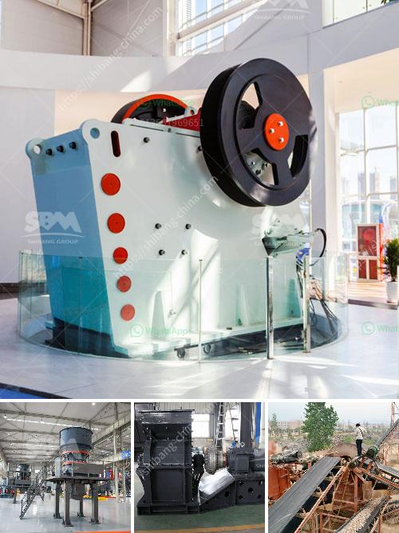

<h3>diagram of stone crusher operation</h3>
A stone crushing machine is an essential piece of equipment for every construction project. Not only do they perform a crucial task of breaking rocks into smaller pieces, they come with a host of other benefits as well. Additionally, they are one of the most versatile machines in any construction fleet.

A diagram of a stone crusher operation showcases the input, throughput, output, and processing stages involved in stone crushing. The plant works with an advanced centralized control panel, thereby minimizing the chances of your process being interrupted or affected by other equipment malfunctions.

The crusher output, which is typically about 0.50 to 2.5 centimeters (3/16th to 1 inch), is returned to the sizing screen. Various product streams with different size gradations are separated in the screening operation. The products are conveyed or trucked directly to finished product bins, to open area stock piles, or to other processing systems such as washing, air separators, and screens and classifiers (for the production of manufactured sand). Some stone crushing plants produce manufactured sand. This is a small-sized rock product with a maximum size of 0.50 centimeters (3/16th inch).

Crushed stone from the tertiary sizing screen is conveyed to various product stockpiles for subsequent crushing, screening, and washing operations.

The rich mineral deposits and archaeological richness of the land has made the mining operations in many parts of the world diverse. In these varied settings, crushing plants are generally configured with smoothening mechanisms that promote the crushing, grinding, and clumping together of materials.

The working principle of jaw crushers is based on the reciprocating movement of the movable jaw that compresses and crushes the rock or ore between itself and the fixed jaw, as the material enters the zone between the jaws. A diagrammatic representation of a jaw crusher is depicted in the figure below.

The feed material is crushed by compressive forces between the crusher shell and the mantle. When the crusher operates, the mantle is pushed against the concave, which is fixed on the main frame, causing the stone to be squeezed and crushed. After the crushing process, the materials with the desired particle size are discharged from the lower part of the machine, while the unwanted materials that do not meet the required size will remain in the crushing chamber until they are broken down to the desired size.

Stone crushing operations involve multiple stages of crushing that all contribute to shaping the final product. Crushing is part of the mining process that begins with drilling and blasting of the ore body. The rock is then transported to the crushing plant, where it is first fed into a feeder, and then into the jaw crusher for primary crushing. After that, the material is transferred to the secondary and tertiary crushers for further reduction and sizing.

In conclusion, a diagram of stone crusher operation highlights the prerequisites and vital equipment in a stone crushing plant. A wide range of materials are available for processing, ensuring versatility and the ability to tailor solutions to meet specific requirements. This article has provided an insight into the various stages of a stone crushing operation and the machines that make them possible.
<h3>Contact us</h3><ul><li><strong>Whatsapp:&nbsp;<a href="https://wa.me/8613661969651">+8613661969651</a></strong></li><li><a href="https://swt.shibang-china.com/?git&amp;zhl&amp;diagram of stone crusher operation"><strong>Online Service(chat now)</strong></a></li></ul><h3>Related</h3><ul><li><a href='feldspar beneficiation plant.md'>feldspar beneficiation plant</a></li><li><a href='quote industrial mill quote ball mills.md'>quote industrial mill quote ball mills</a></li><li><a href='8 kw hammer mill.md'>8 kw hammer mill</a></li><li><a href='crusher machine distributor in zambia.md'>crusher machine distributor in zambia</a></li><li><a href='gypsum crusher plants in india.md'>gypsum crusher plants in india</a></li></ul>