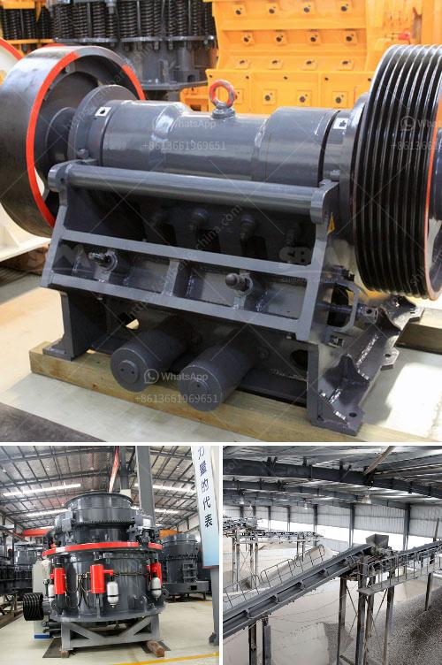

<h3>diamond mining equipment</h3>
The industry of diamond mining revolves around precision, efficiency, and innovation. Diamond mining equipment plays a crucial role in enhancing the overall production capacity and ensuring safety within the mines. With advancements in technology, specialized equipment has been developed to tackle various challenges associated with diamond mining.

One of the most critical pieces of equipment in diamond mining is the mining drill. These drills are specially designed to penetrate the earth's surface efficiently and extract diamond-bearing rock materials. They are equipped with high-powered motors and diamond-encrusted drill bits to cut through the hard layers of soil and rock formations.

Another essential tool in diamond mining is the excavator. These machines dig deep into the ground, removing the overburden (layers of soil, rocks, and vegetation) to expose diamond-rich deposits. Excavators equipped with advanced technology can increase productivity and ensure minimal damage to the gems during extraction.

Transportation within the mines is made possible by specially designed trucks and loaders. These vehicles are engineered to carry heavy loads of diamond-rich materials from one location to another safely. They are equipped with powerful engines and reinforced chassis to navigate the often rough and challenging terrains.

To enhance the efficiency and accuracy of diamond recovery, advanced sorting machines are employed. These machines use various techniques to separate diamonds from other minerals and waste materials. X-ray machines and lasers are commonly used to detect and sort the precious gemstones based on their physical properties, such as size, density, and transparency.

The safety of miners is of paramount importance in the diamond mining industry, which is why specialized safety equipment is essential. This includes personal protective gear such as helmets, coveralls, gloves, and safety shoes. Additionally, gas detectors, ventilation systems, and emergency communication systems are installed to ensure a secure working environment for everyone involved.

In conclusion, diamond mining equipment has revolutionized the industry by enhancing production capacity, ensuring safety, and reducing operational costs. The continuous advancements in technology and innovation have resulted in the development of state-of-the-art machinery and tools that have transformed the diamond mining process. These equipment not only increase efficiency but also promote sustainability in the extraction of one of the world's most precious gemstones.
<h3>Contact us</h3><ul><li><strong>Whatsapp:&nbsp;<a href="https://wa.me/8613661969651">+8613661969651</a></strong></li><li><a href="https://swt.shibang-china.com/?git&amp;zhl&amp;diamond mining equipment"><strong>Online Service(chat now)</strong></a></li></ul><h3>Related</h3><ul><li><a href='wet process and dry process of cement.md'>wet process and dry process of cement</a></li><li><a href='mica pearl process flowchart.md'>mica pearl process flowchart</a></li><li><a href='quote industrial mill quote ball mills.md'>quote industrial mill quote ball mills</a></li><li><a href='mobile iron ore jaw crusher for hire in india.md'>mobile iron ore jaw crusher for hire in india</a></li><li><a href='gypsum crushing plant price in pakistan.md'>gypsum crushing plant price in pakistan</a></li></ul>