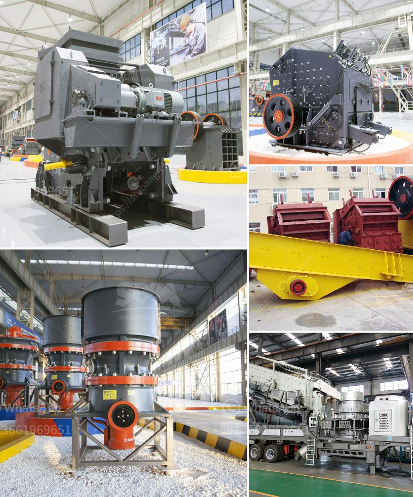

<h3>diamond screening equipment for sale</h3>
In the world of jewelry and gemstones, diamonds stand as the ultimate symbol of luxury, elegance, and sophistication. These precious gems are not only coveted for their brilliant sparkle but also revered for their rarity and durability. However, the diamond market is not without its challenges, as counterfeit stones and poorly cut diamonds can often find their way into the marketplace. That’s where diamond screening equipment comes into play.

Diamond screening equipment refers to advanced technologies and devices specifically designed to identify and assess the authenticity, purity, and quality of diamonds. These tools have revolutionized the way industry professionals handle diamonds, enabling them to confidently determine a stone's characteristics and protect buyers from purchasing counterfeit or inferior products.

One of the most crucial features of diamond screening equipment is its capacity to identify synthetic or lab-grown diamonds. With the advancement of technology, it has become increasingly difficult to distinguish between natural and man-made diamonds with the naked eye. Screening devices such as spectroscopes and diamond testers utilize unique properties of natural diamonds to differentiate them from synthetic variants. The equipment analyzes factors like light reflection, thermal conductivity, and electrical properties to make accurate assessments quickly.

Another important aspect of diamond screening equipment is its ability to determine the quality of a diamond. This is particularly crucial when it comes to assessing the cut, clarity, color, and carat weight of a diamond, commonly referred to as the "Four Cs." Equipment like magnification devices, colorimeters, and carat scales allow professionals to examine and grade diamonds accurately, according to internationally recognized standards. By ensuring the authenticity, purity, and quality of diamonds, these screening tools provide peace of mind for both sellers and buyers alike.

In recent years, portable diamond screening equipment has gained popularity in the market. These compact, handheld devices offer convenience and flexibility for professionals working in different locations, including retail stores, jewelry exhibitions, and gemstone markets. Portable devices employ cutting-edge technologies like UV fluorescence and electrical conductivity to detect and screen diamonds efficiently. They allow customers to witness the assessment process, reassurance that the diamond they are purchasing is genuine.

As the demand for diamonds continues to rise, so does the sophistication of counterfeiting techniques. This necessitates the need for diamond screening equipment that keeps pace with these advancements. Industry experts and laboratories continuously invest in research and development to create more accurate and efficient diamond screening devices. These innovations play a crucial role in preserving the reputation and integrity of the diamond industry, ensuring that authentic and high-quality diamonds find their way to consumers.

In conclusion, diamond screening equipment is an essential tool in the diamond industry. These devices not only help distinguish between natural and synthetic diamonds but also ensure the quality and integrity of the stones. Whether used by gemologists, jewelry retailers, or diamond enthusiasts, these screening devices empower professionals and consumers to make informed decisions. As technology evolves, the future of diamond screening equipment looks promising, giving way to more advanced, reliable, and commercially accessible devices.

Disclaimer: The information in this article is for informational purposes only. It is not intended to be legal, financial, or professional advice. Please consult with a professional before purchasing any diamond screening equipment.
<h3>Contact us</h3><ul><li><strong>Whatsapp:&nbsp;<a href="https://wa.me/8613661969651">+8613661969651</a></strong></li><li><a href="https://swt.shibang-china.com/?git&amp;zhl&amp;diamond screening equipment for sale"><strong>Online Service(chat now)</strong></a></li></ul><h3>Related</h3><ul><li><a href='buy mobile crusher.md'>buy mobile crusher</a></li><li><a href='jaw crusher 50 mt hour for sale.md'>jaw crusher 50 mt hour for sale</a></li><li><a href='jaw crusher with protection.md'>jaw crusher with protection</a></li><li><a href='coal machinery for coal processing crusher.md'>coal machinery for coal processing crusher</a></li><li><a href='river sand and stone mining at sabah.md'>river sand and stone mining at sabah</a></li></ul>