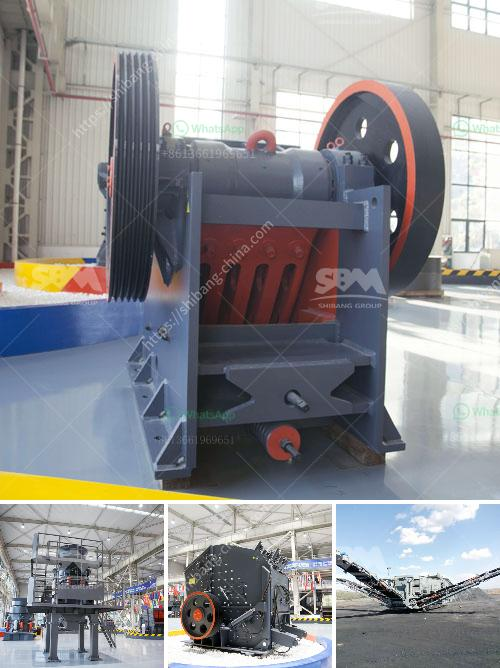

<h3>diamond stone crusher</h3>
Diamonds have been a symbol of beauty and wealth for many centuries. As they are among the hardest natural materials on earth, they have also become synonymous with strength and durability. Therefore, it is no surprise that diamonds have found their way into various industries, including the construction sector. One such application is the diamond stone crusher, which is designed to crush rocks into small pieces for various purposes, such as road construction, building construction, and aggregate production.

The diamond stone crusher is a robust and versatile machine that targets various difficult-to-crush materials, such as basalt, granite, river stone, and quartz. It consists of a rotating diamond-shaped hammer, which is held by a sturdy base. The high-speed movement of the hammer crushes the materials between the hammer and the surrounding hard surface, resulting in their fragmentation into smaller pieces. The crushed materials can then be used for various applications, ranging from the production of concrete to the creation of decorative stones for landscaping.

One of the key advantages of the diamond stone crusher is its versatility. It can be used for various types of rocks and materials, allowing contractors and homeowners to crush different types of stone with a single machine. This reduces the need for multiple machines, thus saving time, money, and space. Additionally, the diamond stone crusher is highly efficient and can crush a large volume of material in a short amount of time. This is particularly beneficial in construction projects where large amounts of aggregate are required.

Another advantage of the diamond stone crusher is its durability. Diamonds are known for their hardness and strength, which makes them ideal for applications that require resistance to wear and tear. The diamond stone crusher is built to withstand heavy use and harsh conditions, ensuring its longevity and reliability. This is essential for contractors and homeowners who want a machine that will last for years without requiring frequent repairs or replacement parts.

In addition to its practical benefits, the diamond stone crusher also adds an aesthetic touch to any construction project. The crushed stones produced by the machine can be used for various decorative purposes, such as creating pathways, driveways, and garden features. The natural sparkle and beauty of the crushed diamonds add a unique and upscale touch to any landscape, making them highly sought after by homeowners and businesses alike.

In conclusion, the diamond stone crusher is a versatile and reliable machine that offers numerous benefits to the construction industry. Its ability to crush a variety of materials, its durability, and its aesthetic appeal make it a valuable asset for contractors and homeowners. Whether used for road construction, building construction, or decorative purposes, the diamond stone crusher provides a practical and stylish solution for crushing and enhancing various types of stones. With its unmatched efficiency and durability, it is no wonder that the diamond stone crusher has become a preferred choice for many construction projects.
<h3>Contact us</h3><ul><li><strong>Whatsapp:&nbsp;<a href="https://wa.me/8613661969651">+8613661969651</a></strong></li><li><a href="https://swt.shibang-china.com/?git&amp;zhl&amp;diamond stone crusher"><strong>Online Service(chat now)</strong></a></li></ul><h3>Related</h3><ul><li><a href='mobile screening plant south africa.md'>mobile screening plant south africa</a></li><li><a href='project report of a tph stone crusher.md'>project report of a tph stone crusher</a></li><li><a href='application of vertical grinding machine.md'>application of vertical grinding machine</a></li><li><a href='equipment design of coal washing plant.md'>equipment design of coal washing plant</a></li><li><a href='how to calculate the powder conveying rate.md'>how to calculate the powder conveying rate</a></li></ul>