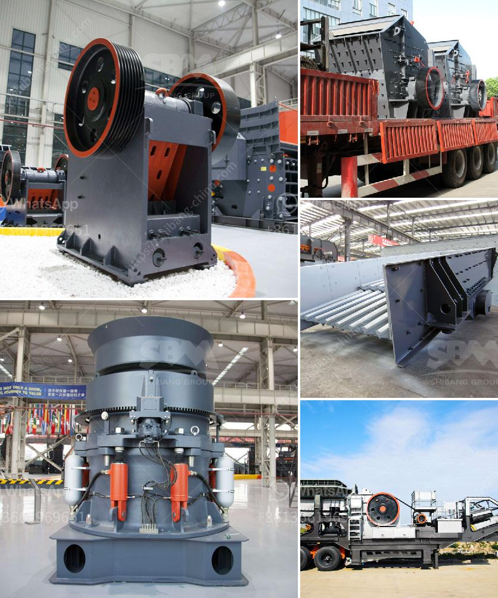

<h3>diesel stone crushers from germany</h3>
Diesel stone crushers from Germany have numerous distinct features that make them highly efficient, durable, and reliable equipment in the construction industry. These crushers utilize diesel power, which can generate immense force to break stones into smaller pieces. With 300-500 words, this article will explore the key features and advantages of diesel stone crushers from Germany.

One of the primary advantages of diesel stone crushers is their mobility. These machines can be easily transported from one location to another, making them perfect for construction sites with constantly changing project requirements. Unlike their electric counterparts, diesel-powered stone crushers do not require a direct power source, allowing them to be used in remote areas where electricity is limited or unavailable.

Despite being powered by diesel engines, these crushers offer exceptional fuel efficiency, resulting in significant cost savings. The fuel consumption of diesel stone crushers is relatively low, allowing contractors and builders to save money on refueling while achieving optimum performance. The efficiency of these machines is further enhanced by their ability to adjust the size of the final product, thanks to adjustable jaws or impact plates.

Furthermore, German diesel stone crushers are known for their robustness and durability. German engineering is renowned for its quality, and this reflects in the construction of these crushers. Heavy-duty materials and high-quality components make them capable of withstanding intense pressure and harsh working conditions, ensuring their longevity and reliability in the field.

The versatility of diesel stone crushers is another key feature that sets them apart. These machines can crush various types of stones, including granite, limestone, river stones, basalt, and many others. Whether it's for road construction, building foundations, or landscaping projects, diesel stone crushers provide the perfect solution for breaking down stones and aggregates into smaller sizes as required.

Another significant advantage of German diesel stone crushers is their accessibility and ease of maintenance. These machines are designed with user-friendly features, allowing operators to carry out routine maintenance and repair tasks with minimal effort. As a result, downtime is reduced, optimizing productivity and keeping construction projects on schedule.

In conclusion, diesel stone crushers from Germany offer many advantages that cater to the needs of the construction industry. Their mobility, fuel efficiency, durability, and versatility make them an excellent choice for contractors and builders alike. Whether it's for large-scale construction projects or smaller tasks, these crushers can efficiently break down stones into smaller sizes, providing the necessary materials for various applications. With their high-quality construction and user-friendly features, German diesel stone crushers guarantee reliable performance, making them a valuable asset for any construction project.
<h3>Contact us</h3><ul><li><strong>Whatsapp:&nbsp;<a href="https://wa.me/8613661969651">+8613661969651</a></strong></li><li><a href="https://swt.shibang-china.com/?git&amp;zhl&amp;diesel stone crushers from germany"><strong>Online Service(chat now)</strong></a></li></ul><h3>Related</h3><ul><li><a href='cost of grinder machine mining crusher.md'>cost of grinder machine mining crusher</a></li><li><a href='lime production plant.md'>lime production plant</a></li><li><a href='ball mill steel balls suppliers in nigeria.md'>ball mill steel balls suppliers in nigeria</a></li><li><a href='manufacturing process of mica crusher.md'>manufacturing process of mica crusher</a></li><li><a href='ball mill lining made in china.md'>ball mill lining made in china</a></li></ul>