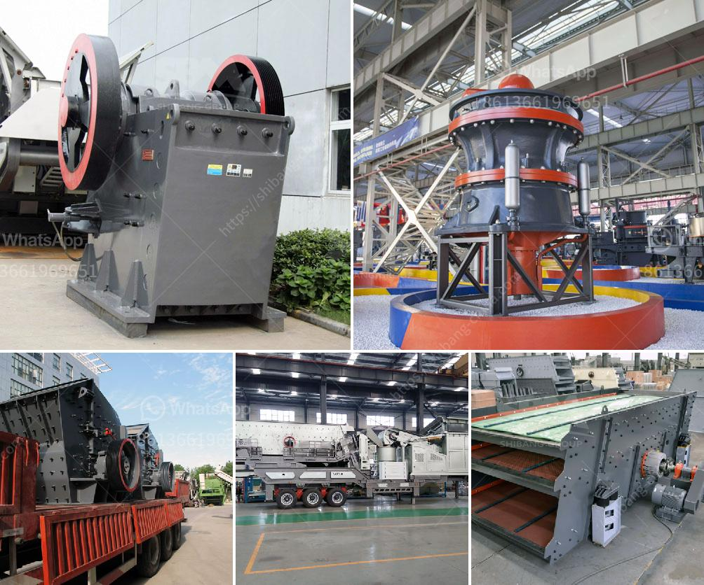

<h3>difference between raymond mill and ball mill</h3>
Raymond mill and ball mill are both commonly used mining equipment, which are used for grinding a variety of ore materials into finer powders. It is important to note that both types of mills have their own advantages and disadvantages.

Raymond mill has a vertical structure, flexible installation, and low noise. The grinding roller is tightly pressed on the grinding ring under the action of centrifugal force, and the material is fed into the grinding chamber from the feeding hopper on the side of the machine. Due to the centrifugal force, the grinding roller swings outwards and tightly presses the grinding ring, so that the grinding roller and the grinding ring are subjected to high-pressure springs, which increases the grinding pressure between the grinding roller and the grinding ring, making the output fineness of the finished product uniform and fine.

Ball mill, on the other hand, is suitable for fine grinding without strict particle size requirements. It is mainly composed of feeding part, discharging part, rotary part, cooling part, and transmission part. The material is fed into the cylinder by the feeding part, and the cylinder is filled with grinding medium (steel balls or steel segments). The rotation of the cylinder generates centrifugal force, which brings the steel balls to a certain height and then falls down, impacting and grinding the material to achieve the desired particle size.

In terms of production capacity, Raymond mill's output is relatively lower compared to ball mill's capacity. However, the maintenance cost of Raymond mill is much lower than that of ball mill. Therefore, Raymond mill is more cost-effective than ball mill in the long run.

In terms of scope of application, Raymond mill is mainly used for processing non-flammable and explosive materials with Mohs hardness below 7 and humidity below 6%, while ball mill is mainly used for grinding various ores and other materials, including cement, silicate products, new building materials, refractory materials, fertilizers, etc.

In conclusion, both Raymond mill and ball mill have their own advantages and disadvantages in terms of structure, maintenance cost, production capacity, and scope of application. It is up to the users to choose the most suitable equipment based on their specific needs and requirements.
<h3>Contact us</h3><ul><li><strong>Whatsapp:&nbsp;<a href="https://wa.me/8613661969651">+8613661969651</a></strong></li><li><a href="https://swt.shibang-china.com/?git&amp;zhl&amp;difference between raymond mill and ball mill"><strong>Online Service(chat now)</strong></a></li></ul><h3>Related</h3><ul><li><a href='categories of conveyor belts.md'>categories of conveyor belts</a></li><li><a href='calcium carbonate mining manufacturer in malaysia.md'>calcium carbonate mining manufacturer in malaysia</a></li><li><a href='primary jaw crusher saudi.md'>primary jaw crusher saudi</a></li><li><a href='hydrated lime production processing.md'>hydrated lime production processing</a></li><li><a href='used copper process plants for sale.md'>used copper process plants for sale</a></li></ul>