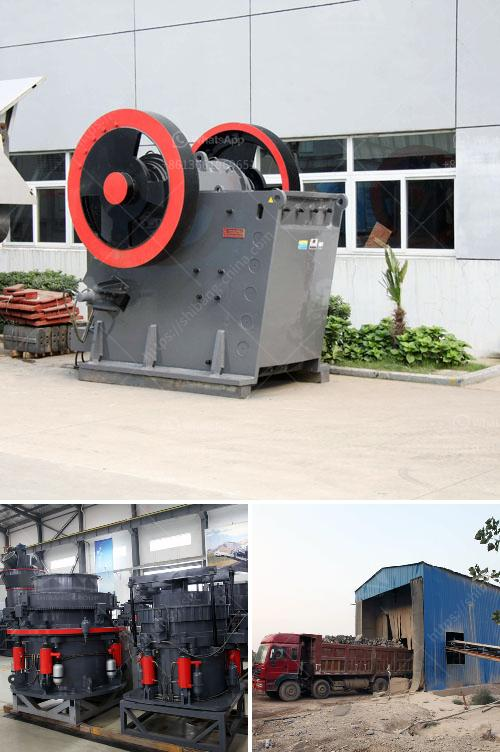

<h3>different between the mill and hammer crusher</h3>
When carrying out mining operations, crushers play a crucial role in breaking down large rocks and stones into smaller pieces. Once crushed, they can be further processed to extract valuable minerals and other raw materials. There are different types of crushers available, each having its own specific functions and features. Understanding the differences between these two types of crushers can help us choose the right equipment for our mining operations.

The primary difference between the two categories of crushers is the shape of the crushing chamber. The crushing chamber of a mill crusher has a horizontal cylindrical shape, whereas the crushing chamber of a hammer crusher is smaller and mostly square or rectangular. Hammer mills are also equipped with impact plates, while mill crushers have more stationary hammers.

In terms of crushing materials, both mill crushers and hammer crushers can process different materials. Hammer mills can process soft, medium-hard, and even brittle materials, while mill crushers can process soft, hard, abrasive, and even fibrous materials.

Hammer mills are capable of producing a wide range of particle sizes. They work best for brittle materials due to their high-speed impacts. The material is fed into the chamber, and the rotating hammers hit it with high kinetic energy, causing fragmentation and reduction in size. The hammers then throw the fragmented particles outward through the grate at a high velocity, resulting in a uniform particle size distribution and a higher percentage of fines.

On the other hand, mill crushers are designed for larger feed sizes and higher reduction ratios. The material is fed into the crushing chamber, where it is compressed and crushed by rotating hammers or plates. The crushed material is discharged through a grate, and the larger particles are retained inside the chamber for further crushing. Mill crushers are ideal for producing finer end products, as the crushing mechanism ensures a more gradual reduction in size, resulting in a more cubic and uniform particle shape.

When it comes to maintenance and operating costs, mills are generally more expensive to maintain and operate compared to hammer crushers. Hammer mills require regular maintenance, such as replacing worn-out hammers and impact plates. They also consume more power and are less efficient compared to mills. However, mills have a longer lifespan and can handle tougher materials.

In conclusion, while both mill crushers and hammer crushers are used for material size reduction in various industrial applications, they differ in terms of their crushing chambers, particle size capabilities, and maintenance requirements. Hammer mills are best suited for brittle materials and produce a more uniform particle size distribution, while mill crushers are more suitable for larger feed sizes and produce finer end products. Choosing the right crusher ultimately depends on the specific requirements and characteristics of the material being processed.
<h3>Contact us</h3><ul><li><strong>Whatsapp:&nbsp;<a href="https://wa.me/8613661969651">+8613661969651</a></strong></li><li><a href="https://swt.shibang-china.com/?git&amp;zhl&amp;different between the mill and hammer crusher"><strong>Online Service(chat now)</strong></a></li></ul><h3>Related</h3><ul><li><a href='sand making machine suppliers in south africa.md'>sand making machine suppliers in south africa</a></li><li><a href='conveyor belts for buckets.md'>conveyor belts for buckets</a></li><li><a href='quote industrial mill quote ball mills.md'>quote industrial mill quote ball mills</a></li><li><a href='new rubber belt conveyor for sale.md'>new rubber belt conveyor for sale</a></li><li><a href='ball mills for large mining.md'>ball mills for large mining</a></li></ul>