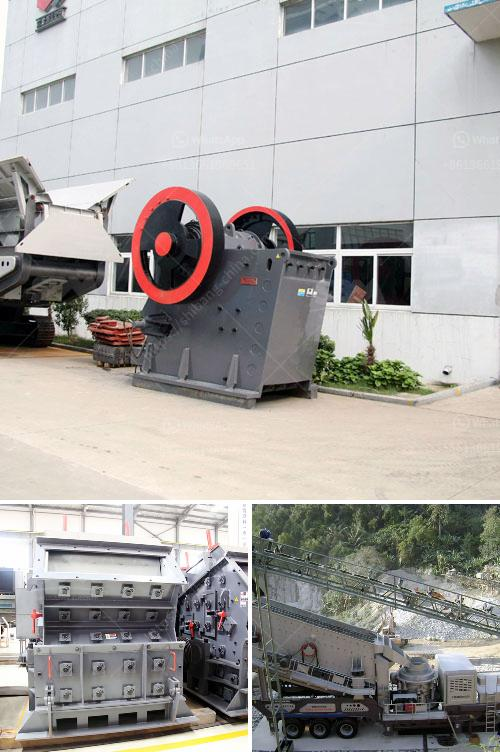

<h3>different type of grinding mills</h3>
Grinding mills are equipment designed to break solid materials into smaller pieces. They are predominantly used in the mining industry to finely grind ore and to release valuable minerals. Different grinding mills serve a wide array of purposes and applications as they can be used in various industries.

Ball mills are the most commonly used type of grinding mill. They offer a low cost and low maintenance alternative to semiautogenous and autogenous mills. Ball mills typically use water or other liquid and additives to help reduce friction and provide cooling during the grinding process. The feed enters one end of the ball mill, and discharges out the other end. Ball mills vary greatly in size, from large industrial ball mills measuring more than 25 ft. in diameter to small mills used for sample preparation in laboratories.

Rod mills are similar to ball mills and use metal rods as the grinding media. Pebble mills use rock pebbles as the grinding media to cause friction and attrition between the pebbles and ore material. Pebble mills may be used when metal balls must be avoided. Autogenous grinding (AG) and semi-autogenous grinding (SAG) mills use the material to be ground as the grinding media. Autogenous grinding mills use larger rocks to impact and break smaller rocks as the mill rotates. Semi-autogenous mills are basically the same autogenous mills, but with the addition of balls, similar to those in ball mills.

Grinding mills – ball, pebble and rod – are all cylindrical rotating shells which are mounted on bearings and filled with up to 40% by volume of grinding media. These mills are divided into multiple chambers along its length with the chambers further divided by diaphragms.

The diaphragms act as partitions, preventing the grinding media from sliding around the circumference of the mill chamber. The size and proportion of the grinding media depend on the characteristics of the material being ground. Common types of grinding media include steel balls, alumina balls, ceramic balls, and glass balls.

Thermal power plants use different types of coal pulverizers. The method used is attrition, impact, or a combination of both. This article explains the characteristics of the three main types- attrition, impact and attrition, and impact or hammer.

Selection of the type of pulverizer depends on the grindability of the coal, the capital costs and maintenance costs, and considerations for licensing. Thermal power plants use different types of coal pulverizers.

The method used is attrition, impact, or a combination of both. This article explains the characteristics of the three main types- attrition, impact and attrition, and impact or hammer. Selection of the type of pulverizer depends on the grindability of the coal, the capital costs and maintenance costs, and considerations for licensing.

Coal pulverizers are designed to achieve the maximum rated capacity grinding a design coal with a grindability of 55 HGI and 8-12% moisture and achieving a discharge fineness of 70% passing 200 mesh (75 micron) and 99.5% passing 50 mesh. These types of mill are designed normally up to 60 tons per hour for a specific coal; however there are vertical mills with 90 tons per hour output.
<h3>Contact us</h3><ul><li><strong>Whatsapp:&nbsp;<a href="https://wa.me/8613661969651">+8613661969651</a></strong></li><li><a href="https://swt.shibang-china.com/?git&amp;zhl&amp;different type of grinding mills"><strong>Online Service(chat now)</strong></a></li></ul><h3>Related</h3><ul><li><a href='rotary kiln cement plant cost in india.md'>rotary kiln cement plant cost in india</a></li><li><a href='raymond mill monterrey.md'>raymond mill monterrey</a></li><li><a href='portable crusher manufacturer.md'>portable crusher manufacturer</a></li><li><a href='basalt crusher machine.md'>basalt crusher machine</a></li><li><a href='stone crush machine price in pakistan.md'>stone crush machine price in pakistan</a></li></ul>