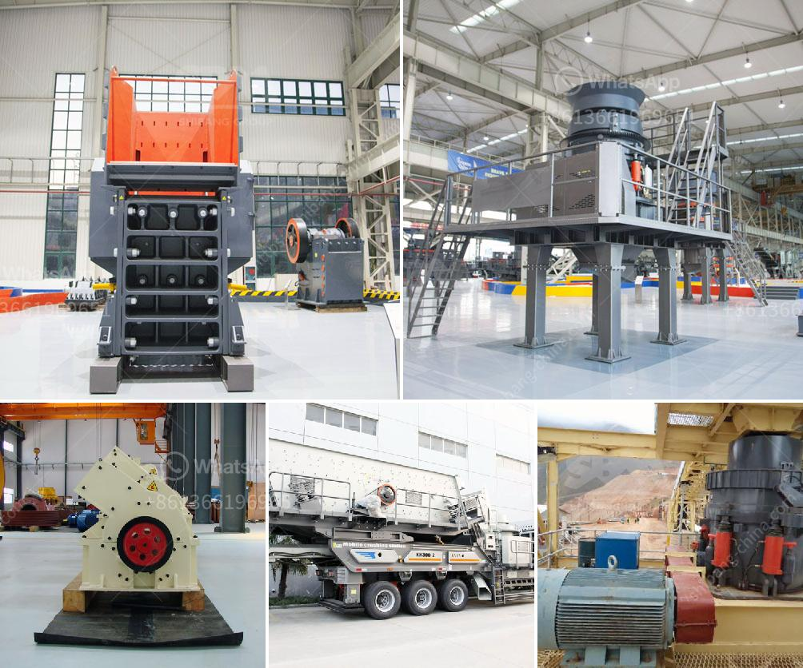

<h3>distributor cone crusher indonesia</h3>
In the mining industry, the cone crusher is a crucial piece of equipment for further reducing the ore materials. And compacting them into a granular and denser form. Cone crushers are typically used for secondary or tertiary crushing stages in hard rock application.

The distributor cone crusher indonesia is located in between the feed plate and the cone crusher liner. When the feed plate is installed, the distributor is installed underneath to distribute the feed material evenly over the chamber height. Furthermore, the distributor cone crusher allows the feed material to flow through the chamber evenly, which reduces the wear and tear on the liners.

The distributor cone crusher indonesia is equipped with a multi-cylinder hydraulic system, which enables the crusher to perform various operating functions with ease. This hydraulic system is designed to control the opening and closing of the crusher chamber. Additionally, it helps to maintain the desired crushing force throughout the crushing process.

One of the key benefits of the distributor cone crusher indonesia is its versatility. It can be used for a wide range of applications, including mineral processing, mining, construction aggregate, and more. The cone crusher is capable of producing high-quality products with excellent particle shape and size.

Another advantage of the distributor cone crusher indonesia is its efficiency. By using a multi-cylinder hydraulic system, the crusher can provide a higher crushing ratio and greater productivity. This means that less energy is required to crush the materials, resulting in lower operating costs and improved overall efficiency.

Additionally, the distributor cone crusher indonesia offers easy maintenance and operation. The hydraulic system allows for quick and easy adjustments to the crusher settings, ensuring optimal performance and maximum productivity. The crusher is also equipped with a reliable lubrication system, which reduces the risk of mechanical failures and extends the lifespan of the equipment.

The distributor cone crusher indonesia is widely used in the mining industry due to its high production efficiency, stable performance, and easy maintenance. It is the ideal choice for processing large-scale rock materials.

In conclusion, the distributor cone crusher indonesia is a high-quality crushing equipment that offers reliable performance, versatility, and efficiency. It is designed to reduce the size of the ore materials for further processing and to provide optimal particle shape and size. With its advanced hydraulic system and easy maintenance features, this crusher is a valuable asset in any mining operation.
<h3>Contact us</h3><ul><li><strong>Whatsapp:&nbsp;<a href="https://wa.me/8613661969651">+8613661969651</a></strong></li><li><a href="https://swt.shibang-china.com/?git&amp;zhl&amp;distributor cone crusher indonesia"><strong>Online Service(chat now)</strong></a></li></ul><h3>Related</h3><ul><li><a href='jaw crusher engine and complete set.md'>jaw crusher engine and complete set</a></li><li><a href='mobile crusher plant for sale.md'>mobile crusher plant for sale</a></li><li><a href='coal wash and crusher machine.md'>coal wash and crusher machine</a></li><li><a href='double roll crusher price lazada.md'>double roll crusher price lazada</a></li><li><a href='vertical cement grinding mill from 10 20 tph.md'>vertical cement grinding mill from 10 20 tph</a></li></ul>