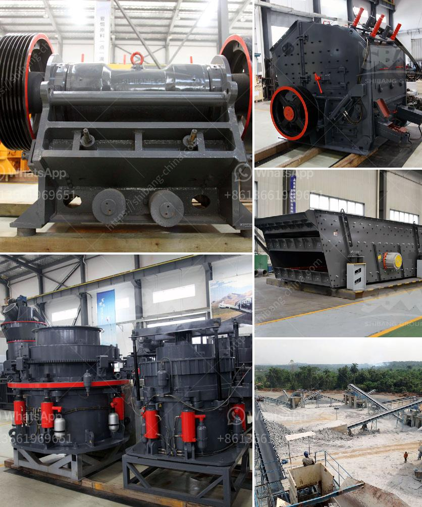

<h3>distributors of conveyor belts in mexico</h3>
Conveyor belts are an essential part of numerous industries, facilitating the transportation of materials and products from one point to another. With Mexico being a key manufacturing hub, it comes as no surprise that the country boasts a substantial market for conveyor belts. The efficient functioning of these industrial systems heavily relies on the expertise and reliable services provided by distributors of conveyor belts in Mexico.

Over the past few decades, Mexico has emerged as a significant manufacturing powerhouse, attracting investment and becoming a vital player in global supply chains. The nation's strong manufacturing sector is credited to its advantageous location, competitive labor costs, and extensive trade agreements, such as the United States-Mexico-Canada Agreement (USMCA).

Industries like automotive, food processing, mining, packaging, and construction heavily rely on conveyor belts to streamline their operations. The ability to transport goods seamlessly across various stages of production is an essential factor in maintaining efficiency and productivity. Hence, reliable and high-quality conveyor belt distributors play a crucial role in supporting these industries and the overall Mexican economy.

Distributors of conveyor belts in Mexico act as intermediaries between manufacturers and end-users, bridging the gap and ensuring a smooth supply chain. These distributors not only provide a wide range of conveyor belt options but also offer expert advice, tailored solutions, and after-sales support to their customers.

One of the primary advantages provided by distributors is their extensive knowledge and understanding of the diverse needs of different industries. They are experienced in selecting the appropriate conveyor belt type, material, and design to suit specific applications. Whether it's a heavy-duty conveyor belt for mining or a modular belt for the food industry, distributors can guide customers in making the right choice.

Furthermore, conveyor belt distributors in Mexico maintain significant inventories, ensuring prompt availability of different belt types, sizes, and accessories. This reduces lead times and ensures that production processes are not disrupted by unexpected breakdowns or delays.

Several notable distributors of conveyor belts operate in Mexico, catering to the diverse needs of various industries. These distributors often work in close collaboration with global suppliers to provide customers with top-quality products. Some of the renowned distributors include ABC Grupo, Bandas y Servicios, and Almex Group.

ABC Grupo, headquartered in Monterrey, offers a comprehensive range of conveyor belts, including PVC, PU, rubber, and modular belts. The company emphasizes customer satisfaction and provides technical support and maintenance for optimal performance.

Bandas y Servicios, with branches across the country, specializes in conveyor belts for the food industry. The company's expertise includes FDA-approved belts for direct food contact and hygienic designs, ensuring compliance with industry standards.

Almex Group, an international company with a presence in Mexico, focuses on providing innovative solutions for conveyor belt splicing and repair. Their services are crucial for minimizing downtime and ensuring the longevity of conveyor belts.

Conveyor belts are the lifeline of many Mexican industries. The efficiency, reliability, and durability of these systems are directly influenced by the expertise and services provided by conveyor belt distributors. With their knowledge and support, these distributors contribute significantly to ensuring the smooth functioning of Mexico's manufacturing sector and its continued growth on the global stage.
<h3>Contact us</h3><ul><li><strong>Whatsapp:&nbsp;<a href="https://wa.me/8613661969651">+8613661969651</a></strong></li><li><a href="https://swt.shibang-china.com/?git&amp;zhl&amp;distributors of conveyor belts in mexico"><strong>Online Service(chat now)</strong></a></li></ul><h3>Related</h3><ul><li><a href='ball mill equipment 150 tons hr.md'>ball mill equipment 150 tons hr</a></li><li><a href='gold plant for sale in africa.md'>gold plant for sale in africa</a></li><li><a href='hard rock quarry cursher in libya.md'>hard rock quarry cursher in libya</a></li><li><a href='crusher mill sales in malaysia.md'>crusher mill sales in malaysia</a></li><li><a href='crusher near sale saudi arabia.md'>crusher near sale saudi arabia</a></li></ul>