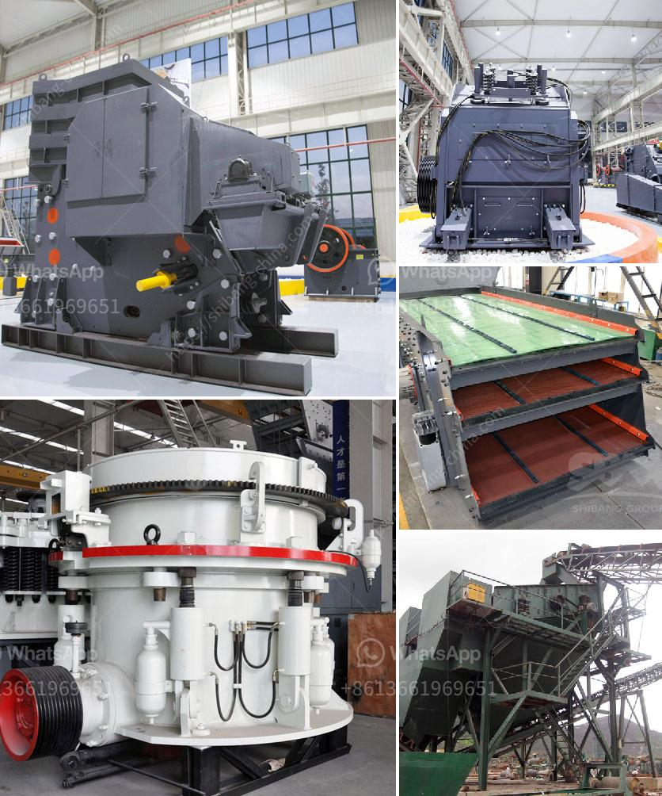

<h3>dolomite crusher turkey 200 ton price</h3>
Dolomite is a natural mineral composed of calcium magnesium carbonate, commonly sourced from limestone, marble, and other rock formations. Its unique properties make it an ideal material for various industries, including construction, agriculture, and manufacturing. As the demand for dolomite continues to rise, Turkey stands out as a major supplier in the global market.

One of the more efficient ways to extract dolomite is through crushing it into small granules. This process offers numerous benefits, including reducing overall transportation costs and ensuring that the product is readily available for use. The dolomite crusher plant in Turkey provides unbeatable prices on a wide range of samples.

Turkey possesses a wide variety of reserves that are geographically distributed throughout the country. A small number of them are currently operating, which has resulted in a limited supply. This scarcity has driven up the price of dolomite, making it a valuable commodity for both local and international customers.

The price of dolomite crusher in Turkey varies greatly depending on the specifications and the specific location and conditions of the project. Most dolomite deposits are sourced from relatively shallow depths, and thus their mining can be undertaken using simple and inexpensive methods. Some deposits can be excavated with regular excavation equipment. Others require deeper minings, requiring specialized equipment and expertise.

The availability of dolomite resources and expertise in mining techniques will vary greatly by location. This is why it is important to seek out experienced professionals in the field who can navigate these challenges and secure the best pricing for you.

Moreover, other operational and logistical factors such as transportation costs, customs duties, taxes, and other fees can also impact the final price of dolomite crusher in Turkey. Considering all these elements is crucial when planning any excavation or construction project that requires dolomite.

In conclusion, the price of dolomite crusher in Turkey is influenced by a variety of factors and fluctuates constantly. However, with practical insight and a well-structured approach, you can secure the most affordable option that suits your specific requirements. By consulting with professionals in the field, you can ensure your project remains cost-effective while still maintaining high-quality dolomite.
<h3>Contact us</h3><ul><li><strong>Whatsapp:&nbsp;<a href="https://wa.me/8613661969651">+8613661969651</a></strong></li><li><a href="https://swt.shibang-china.com/?git&amp;zhl&amp;dolomite crusher turkey 200 ton price"><strong>Online Service(chat now)</strong></a></li></ul><h3>Related</h3><ul><li><a href='second hand coal mining crushers in zimbabwe.md'>second hand coal mining crushers in zimbabwe</a></li><li><a href='200tph mobile crusher prices used.md'>200tph mobile crusher prices used</a></li><li><a href='cement clinker grinding equipmenttpd.md'>cement clinker grinding equipmenttpd</a></li><li><a href='gravel crushing machine.md'>gravel crushing machine</a></li><li><a href='portal gold mining machine.md'>portal gold mining machine</a></li></ul>