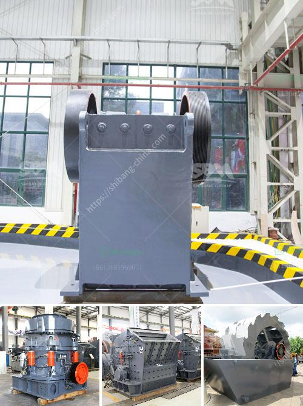

<h3>dolomite crushing machine for sale dubai</h3>
Dolomite is a carbonate mineral that is found in sedimentary rocks. It is commonly used in both the construction industry and the agriculture industry as a fertilizer and soil conditioner. Dolomite also serves as an ornamental stone, particularly in bathroom countertops and flooring. With its versatile applications, the demand for dolomite has increased significantly in recent years.

To meet the growing demand for dolomite, various industries rely on efficient crushing machines. A dolomite crushing machine is essential in order to break down the large rocks into smaller pieces and provide them with an appropriate size for various applications. Crushing machines are used to obtain the required dolomite materials for various industrial sectors, such as building materials, chemicals, metallurgy, mining, etc.

Dubai is a fast-growing construction market and the demand for dolomite in the region is high. Many quarries and mines distribute dolomite across the UAE, providing ample opportunities for suppliers and manufacturers. In order to cater to this demand, crushing machine manufacturers have expanded their operations to Dubai.

When looking for a dolomite crushing machine for sale, it is important to keep in mind several factors. Firstly, the size of the machine is essential, as larger machines tend to produce higher yields. Secondly, the production capacity of the machine should be suitable for the specific application it will be used for. Finally, it is crucial to consider the efficiency and durability of the machine to ensure long-term use without frequent breakdowns or repairs.

In Dubai, there are various companies and suppliers that offer dolomite crushing machines for sale. Some machines are designed for specific industries, such as the mining industry, while others are more versatile and can be used in multiple sectors. Researching and comparing different machines is essential to find the best one that suits your requirements.

One popular dolomite crushing machine in Dubai is the jaw crusher. This machine is an excellent choice for primary crushing applications. It is designed to crush large dolomite stones into smaller particles, reducing the need for secondary crushing operations. The jaw crusher has a high production capacity and can process up to 600 tons of dolomite per hour.

Another commonly used dolomite crushing machine is the impact crusher. This machine is especially suitable for processing dolomite rocks with soft or medium hardness. The impact crusher uses the principle of impact crushing, which provides high crushing efficiency and excellent particle shape. It is a versatile machine that can be used in various applications, including the construction industry.

In conclusion, the demand for dolomite in Dubai is increasing, and the availability of efficient crushing machines is essential. When searching for a dolomite crushing machine for sale in Dubai, it is important to consider factors such as size, production capacity, efficiency, and durability. Jaw crushers and impact crushers are popular choices, depending on the specific requirements of the industry. Researching and comparing different machines will help you find the best option for your needs, ensuring efficient dolomite crushing for your business.
<h3>Contact us</h3><ul><li><strong>Whatsapp:&nbsp;<a href="https://wa.me/8613661969651">+8613661969651</a></strong></li><li><a href="https://swt.shibang-china.com/?git&amp;zhl&amp;dolomite crushing machine for sale dubai"><strong>Online Service(chat now)</strong></a></li></ul><h3>Related</h3><ul><li><a href='crusher machine for sale philippines.md'>crusher machine for sale philippines</a></li><li><a href='grinding ball mill machine manufacturer europe.md'>grinding ball mill machine manufacturer europe</a></li><li><a href='300 tone per hour limestone crusher.md'>300 tone per hour limestone crusher</a></li><li><a href='modular conveyor belt supplier china.md'>modular conveyor belt supplier china</a></li><li><a href='slag peralatan pabrik vertikal.md'>slag peralatan pabrik vertikal</a></li></ul>