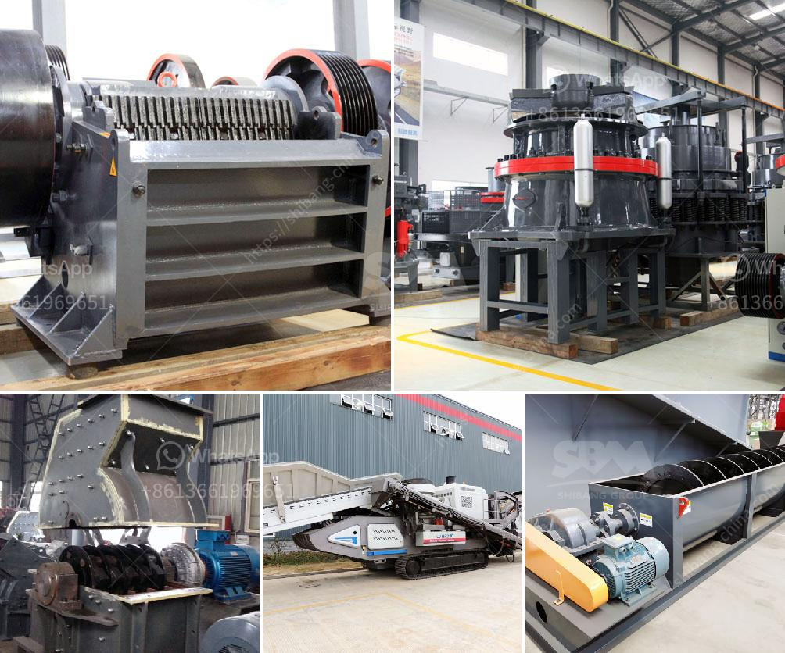

<h3>dolomite grinding machines suppliers in india</h3>
Dolomite is a natural mineral composed of calcium and magnesium carbonate, which is processed into a fine powder for various applications. Grinding equipment is used to process dolomite into powder form, which is used in various industrial sectors. Dolomite powder is widely used in agriculture, construction, ceramics, and water treatment industries. So, finding dolomite grinding machines suppliers in India is crucial for the processing industry.

To meet the demand for dolomite powder, manufacturers in India focus on producing dolomite grinding machines. These machines can grind dolomite into different sizes and particle shapes for various applications. In addition, they can manufacture different capacities of dolomite grinding machines suitable for different production requirements.

One trusted dolomite grinding machine supplier in India is Shanghai Clirik Machinery Co., Ltd. This company has been in the industry for more than a decade and has rich experience in dolomite processing. They have a team of experts who provide the best products and service to customers. The company ensures that they meet the industry standards and regulations during the production process.

Shanghai Clirik Machinery Co., Ltd offers a wide range of dolomite grinding machines, ranging from 100 to 2500 mesh. They also provide customized grinding solutions, ensuring that customers get the right machine for their specific needs. The machines offered by Clirik Machinery are known for their high efficiency, low energy consumption, and long service life.

Another reputed dolomite grinding machine supplier in India is HGM ultrafine mill. This mill is manufactured by Shanghai Clirik Machinery Co., Ltd. It is designed with advanced technology and finite element analysis. The mill is equipped with a high-efficiency pulse dust collector, which is more efficient and environmentally friendly.

HGM ultrafine mill for dolomite grinding is also equipped with a frequency conversion system. This system can adjust the rotational speed of the mill based on the hardness of the material, ensuring efficient grinding. The mill is also equipped with an automatic control system, which can remotely control the start and stop of the machine, saving manpower and reducing labor costs.

Apart from Shanghai Clirik Machinery Co., Ltd, there are several other dolomite grinding machine suppliers in India. These suppliers are investing in research and development to offer the best quality machines to their customers. They are also focusing on implementing advanced technologies to improve the efficiency of grinding operations.

Finding reliable dolomite grinding machine suppliers in India can be a daunting task, as there are several options available. However, by considering factors such as the reputation of the supplier, the quality of their machines, and customer reviews, one can choose a reliable supplier. It is also essential to compare the prices offered by different suppliers to get the best deal.

In conclusion, dolomite grinding machines are essential for the processing industry in India. Several reputed dolomite grinding machine suppliers in India offer high-quality products and services. They provide customized grinding solutions and ensure efficient grinding operations. By considering various factors, customers can find a reliable supplier who can meet their specific requirements.
<h3>Contact us</h3><ul><li><strong>Whatsapp:&nbsp;<a href="https://wa.me/8613661969651">+8613661969651</a></strong></li><li><a href="https://swt.shibang-china.com/?git&amp;zhl&amp;dolomite grinding machines suppliers in india"><strong>Online Service(chat now)</strong></a></li></ul><h3>Related</h3><ul><li><a href='grinding or crushing for gypsum pdf.md'>grinding or crushing for gypsum pdf</a></li><li><a href='grinding ball mill machine manufacturer europe.md'>grinding ball mill machine manufacturer europe</a></li><li><a href='sand and gravel dryer equipment qatar.md'>sand and gravel dryer equipment qatar</a></li><li><a href='ball mill manufacturer in sri lanka.md'>ball mill manufacturer in sri lanka</a></li><li><a href='stone jaw crusher machine.md'>stone jaw crusher machine</a></li></ul>