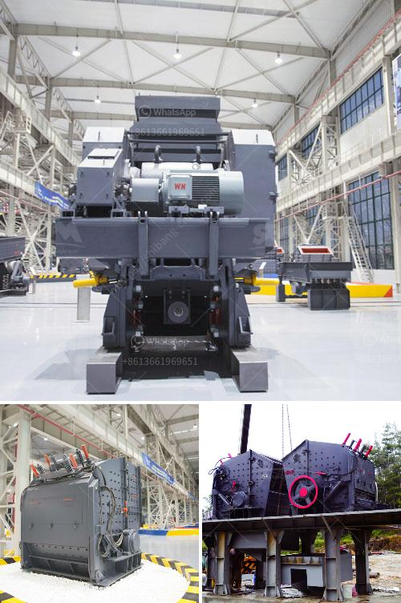

<h3>dolomite ore processing</h3>
Dolomite is a mineral composed of calcium magnesium carbonate. It is used as a flux for smelting iron and steel, as well as a raw material for the production of refractory materials, cement, glass, and fertilizer. Dolomite is abundant in many parts of the world and can be extracted through various methods. This article will explore the process of dolomite ore processing and highlight its importance in various industries.

The first step in the processing of dolomite ore involves crushing. Dolomite ore is crushed and heated in a kiln to produce a mixture of magnesium oxide (MgO) and calcium oxide (CaO), commonly known as lime. The process of calcination is often carried out in rotary kilns, which are inclined cylindrical drums lined with refractory materials.

After calcination, dolomite ore undergoes a process called hydration. Hydration is the reaction of quicklime with water, resulting in the formation of calcium hydroxide. This reaction is exothermic and releases a significant amount of heat. The hydration process is crucial for transforming the calcium oxide obtained from dolomite ore into a usable form for various applications.

The hydrated dolomite, also known as slaked lime or calcium hydroxide, can be further processed to produce a range of end products. One important product is high-quality quicklime, which is used as a flux in the smelting of iron and steel. Quicklime helps remove impurities such as silica and alumina during the smelting process, improving the quality of the final product.

Another application of dolomite ore is in the production of refractory materials. Refractory materials are heat-resistant substances used in lining furnaces, kilns, and other high-temperature industrial processes. Dolomite, due to its high melting point and resistance to heat, is an excellent choice for manufacturing refractory bricks and shapes. These materials can withstand extreme temperature conditions, ensuring the longevity and efficiency of industrial equipment.

Dolomite ore is also an essential ingredient in the production of cement. When combined with other materials such as limestone, shale, and gypsum, dolomite acts as a flux, promoting the fusion and sintering of these components during the manufacturing process. This results in the formation of clinker, which is then ground into a fine powder to produce cement. The addition of dolomite enhances the strength and durability of the resulting cement, making it suitable for various construction applications.

Furthermore, dolomite ore can be processed into agricultural lime, which is used to neutralize acidic soil. Acidic soil conditions can hinder plant growth and reduce crop yields. By adding dolomite or dolomitic lime to the soil, farmers can adjust the pH level, providing an optimum environment for plants to thrive. This agricultural lime provides essential nutrients such as calcium and magnesium to the soil, promoting healthier plant growth and higher crop yields.

In conclusion, the processing of dolomite ore plays a crucial role in various industries. From its use as a flux in smelting processes to the production of refractory materials, cement, and agricultural lime, dolomite ore contributes to the advancement of different sectors. Its abundant availability and versatile applications make it a valuable mineral resource globally.
<h3>Contact us</h3><ul><li><strong>Whatsapp:&nbsp;<a href="https://wa.me/8613661969651">+8613661969651</a></strong></li><li><a href="https://swt.shibang-china.com/?git&amp;zhl&amp;dolomite ore processing"><strong>Online Service(chat now)</strong></a></li></ul><h3>Related</h3><ul><li><a href='vibrating screen in cement plant.md'>vibrating screen in cement plant</a></li><li><a href='vibrating screen designs.md'>vibrating screen designs</a></li><li><a href='project report for quartz stone plant and quarry.md'>project report for quartz stone plant and quarry</a></li><li><a href='jaw industry limestone process in malaysia.md'>jaw industry limestone process in malaysia</a></li><li><a href='plant plant silica washing washing plant.md'>plant plant silica washing washing plant</a></li></ul>