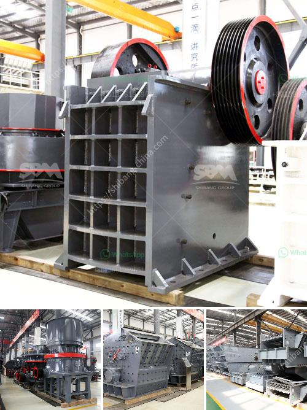

<h3>dolomite process peritidal subtidal</h3>
The formation of dolomite, a mineral composed of calcium magnesium carbonate, has intrigued scientists for centuries. Geologists have been particularly fascinated by its association with peritidal subtidal environments. This article will shed light on the dolomite process that occurs in these unique zones.

Peritidal subtidal zones are the areas located between the high and low tide marks. They are constantly influenced by the ebb and flow of the tides, making them dynamic and ever-changing. These zones are rich in marine life, providing a perfect breeding ground for diverse organisms.

Dolomite formation in peritidal subtidal environments occurs in several stages. Initially, the area is inundated by seawater during high tide. Algae and other organic matter thriving in these zones produce carbon dioxide, which dissolves in the water. This dissolved carbon dioxide reacts with magnesium and calcium ions present in the seawater, resulting in the precipitation of dolomite.

The next stage in the dolomite process involves evaporation. As the tide retreats, the trapped seawater in the peritidal subtidal zones begins to evaporate under the influence of heat and dry conditions. This evaporation process leads to an increase in the concentration of dissolved minerals in the remaining water, promoting further dolomite precipitation.

The final stage occurs when the area is exposed to the atmosphere during low tide. The dolomite crystals formed in the previous stages remain in the sediment, compacting over time. The resulting dolostone, a rock composed primarily of dolomite, is often characterized by its distinctive patterns and structures.

Understanding the dolomite process in peritidal subtidal zones is not only crucial for geological research but also essential for environmental preservation. Dolomite contributes to the stability and strength of rocks, helping to prevent coastal erosion. Its unique structural properties also make it an excellent reservoir for oil and gas.

In conclusion, the dolomite process in peritidal subtidal zones is a fascinating geological phenomenon. The interplay of factors such as seawater, organic matter, evaporation, and exposure to the atmosphere influences the precipitation and formation of dolomite. By delving deeper into this process, scientists can gain valuable insights into our planet's history and explore ways to harness dolomite for various applications.
<h3>Contact us</h3><ul><li><strong>Whatsapp:&nbsp;<a href="https://wa.me/8613661969651">+8613661969651</a></strong></li><li><a href="https://swt.shibang-china.com/?git&amp;zhl&amp;dolomite process peritidal subtidal"><strong>Online Service(chat now)</strong></a></li></ul><h3>Related</h3><ul><li><a href='stone crusher 80 tons of jam.md'>stone crusher 80 tons of jam</a></li><li><a href='the process of cement making with ball mills.md'>the process of cement making with ball mills</a></li><li><a href='grinding roller mill.md'>grinding roller mill</a></li><li><a href='blast slag grinding machine india.md'>blast slag grinding machine india</a></li><li><a href='pebble crushing equipment.md'>pebble crushing equipment</a></li></ul>