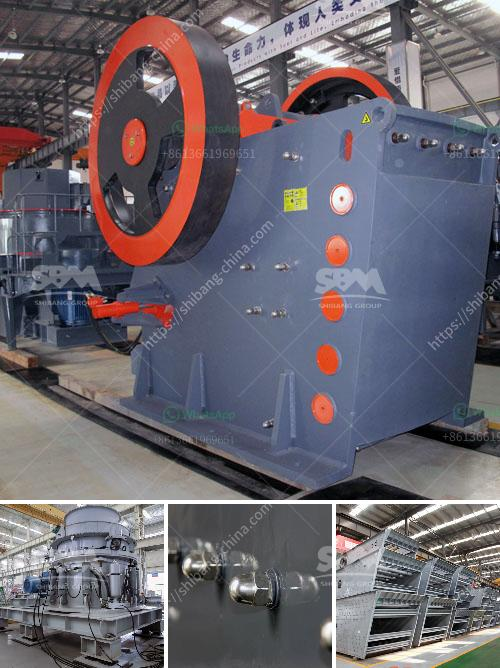

<h3>dolomite production process</h3>
Dolomite, also known as calcium magnesium carbonate, is a common mineral used for the production of cement, mineral fillers, construction materials, ceramics, glass, fertilizers, and many other industrial and agricultural applications. Dolomite is found in sedimentary basins around the world and is formed by the alteration of limestone through the process of dolomitization.

The production of dolomite involves several steps, from quarrying to crushing, screening, sorting, and finally the conversion of raw dolomite into various products. Quarrying is the first and crucial step, which involves the extraction of raw dolomite blocks from the earth's crust. This is often done using heavy machinery and explosives to break down the rock formations and access the dolomite deposits.

Once the dolomite blocks are obtained, they are transported to a crushing machine, where they are broken down into smaller pieces. Crushing is done using jaw crushers, gyratory crushers, or cone crushers, depending on the desired size. The crushed dolomite is then screened to remove impurities and separate it into different particle sizes.

After screening, the dolomite is typically treated with various chemicals to enhance its properties or remove impurities. This process, known as beneficiation or chemical treatment, involves the use of chemicals such as sodium carbonate, acid, or other reagents to achieve the desired properties of the final product. The dolomite may undergo further grinding or milling to produce a fine powder for specific applications.

Once the dolomite is processed and prepared, it can be used in a wide range of applications. In the construction industry, dolomite is commonly used as an aggregate in concrete mixes or as a base material for roads and buildings. Its high strength and durability make it an ideal material for such applications. Dolomite is also used as a flux in the production of steel and as a raw material for the production of glass, ceramics, and other refractory materials.

In agriculture, dolomite is widely used as a soil conditioner to neutralize acidic soils and provide essential nutrients to plants. Its ability to raise pH levels and improve soil structure makes it an effective way to enhance crop productivity.

Overall, the production process of dolomite involves multiple steps, from quarrying to crushing, screening, beneficiation, and finally the conversion of raw dolomite into various products. This versatile mineral finds applications in various industries, from construction to agriculture, due to its unique properties and abundance. Dolomite continues to play a vital role in our everyday lives, contributing to the development of infrastructure and enhancing agricultural productivity.
<h3>Contact us</h3><ul><li><strong>Whatsapp:&nbsp;<a href="https://wa.me/8613661969651">+8613661969651</a></strong></li><li><a href="https://swt.shibang-china.com/?git&amp;zhl&amp;dolomite production process"><strong>Online Service(chat now)</strong></a></li></ul><h3>Related</h3><ul><li><a href='stone crusher jaw mini produksi indonesia.md'>stone crusher jaw mini produksi indonesia</a></li><li><a href='crushing plant price list.md'>crushing plant price list</a></li><li><a href='hammer mill clays price.md'>hammer mill clays price</a></li><li><a href='conveyor belts for mining.md'>conveyor belts for mining</a></li><li><a href='automated roller conveyors.md'>automated roller conveyors</a></li></ul>