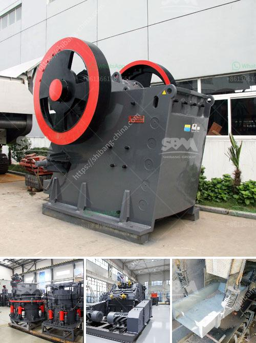

<h3>dolomite refractory processing</h3>
Dolomite refractories play a crucial role in various high-temperature applications, such as furnaces, kilns, and ladle linings in industrial sectors like steelmaking, cement production, and glass manufacturing. Its unique properties and ability to withstand extreme temperatures have made dolomite an indispensable material in these industries. In this article, we will delve into the processing of dolomite refractories and explore how it enhances heat resistance and durability.

Dolomite, a mineral composed of calcium magnesium carbonate (CaMg(CO3)2), is primarily obtained from natural deposits through mining. These raw dolomite rocks undergo processing to meet the specific requirements of refractory applications. The processing involves various steps, including crushing, calcination, milling, and sintering, which transform the raw dolomite into a refractory product with enhanced characteristics.

The first step in dolomite refractory processing is crushing. Large dolomite rocks are crushed into smaller particles to facilitate further processing. The crushed dolomite is then heated in a kiln, a process known as calcination. Calcination removes impurities and carbon dioxide, resulting in a high-purity dolomite product. This calcined dolomite possesses improved chemical stability and is more suitable for refractory applications.

The next step involves milling the calcined dolomite to achieve the desired particle size distribution. Milling not only reduces the particle size but also enhances the homogeneity of the dolomite powder. The finely milled dolomite is then sintered at high temperatures to create a dense and robust refractory brick or shape.

During the sintering process, the dolomite particles bond together, forming a solid structure. The high temperatures cause the particles to partially melt, enabling them to fuse and create strong interparticle bonds. This sintering process enhances the heat resistance and durability of the dolomite refractory, enabling it to withstand extreme temperatures and chemical reactions.

The resulting dolomite refractories exhibit excellent resistance to thermal shock, thermal conductivity, and corrosion. These properties make them ideal for lining furnaces, kilns, and other high-temperature equipment, where they protect the underlying structures from heat damage and ensure prolonged service life.

Moreover, dolomite refractories have low porosity, which prevents the penetration of molten slags or metal oxides and minimizes heat losses. This low porosity also reduces the risk of spalling or cracking under thermal stress, further enhancing the refractory's longevity and reliability.

In conclusion, dolomite refractory processing involves several crucial steps, including crushing, calcination, milling, and sintering, to create a high-quality refractory product. This processing enhances the heat resistance and durability of the dolomite, enabling it to withstand extreme temperatures and chemical reactions. Dolomite refractories find widespread applications in industries such as steelmaking, cement production, and glass manufacturing, where they protect and extend the lifespan of high-temperature equipment. The unique properties of dolomite refractories make them an indispensable material in these industries, contributing to their efficiency and productivity.
<h3>Contact us</h3><ul><li><strong>Whatsapp:&nbsp;<a href="https://wa.me/8613661969651">+8613661969651</a></strong></li><li><a href="https://swt.shibang-china.com/?git&amp;zhl&amp;dolomite refractory processing"><strong>Online Service(chat now)</strong></a></li></ul><h3>Related</h3><ul><li><a href='small ball mill prices in kenya.md'>small ball mill prices in kenya</a></li><li><a href='stone crusher suppliers in indore.md'>stone crusher suppliers in indore</a></li><li><a href='grinding machines for clay.md'>grinding machines for clay</a></li><li><a href='cement plant price in pakistan.md'>cement plant price in pakistan</a></li><li><a href='components cone crusher and hydraulic system.md'>components cone crusher and hydraulic system</a></li></ul>