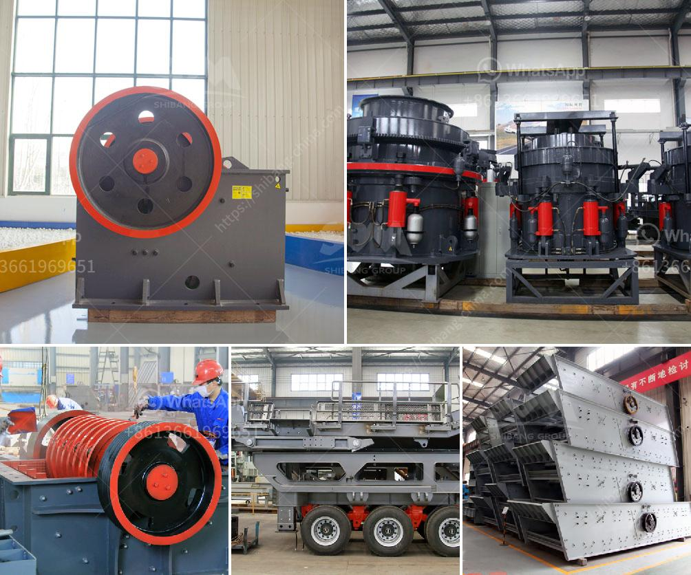

<h3>double roll crusher price lazada</h3>
Double roll crusher, also called roller crusher, consists of two cylindrical rollers assembled horizontally on a rotating shaft. Sometimes, the roller surface is smooth, sometimes it's toothed. The material is fed into the crushing chamber and encounters an opposite rotating motion of the rollers, which is usually categorized as primary, secondary, or tertiary crushing action.

The double roll crusher is a versatile and reliable machine suitable for medium and fine crushing of materials such as coal, coke, limestone, clay, and other brittle materials. It's a great choice for industries such as mining, metallurgy, building material, and chemical, among others.

When considering the price of a double roll crusher, various factors come into play. One of the main aspects to consider is the quality and efficiency of the machine. Higher quality crushers generally come with a higher price tag, but they also tend to last longer and require less maintenance, leading to a better return on investment in the long run.

Another factor affecting the price of a double roll crusher is the type and specifications of the machine. Different models and sizes accommodate various production requirements and material properties. For instance, while a smaller roll crusher may be sufficient for a smaller production capacity, a larger one with higher capacity and more advanced features such as adjustable discharge size or automatic overload protection may be necessary for a higher production demand.

Additionally, the brand and reputation of the manufacturer can influence the price of a double roll crusher. Well-established brands often have a higher price due to the trust and reliability associated with their products. However, it is important to note that lesser-known or newer brands can also offer high-quality crushers at a competitive price, so it's essential to research and compare different options.

When looking for a double roll crusher at an affordable price, online marketplaces like Lazada can be an excellent option. Lazada is a renowned e-commerce platform that offers a wide range of products, including double roll crushers, from various sellers. It allows users to compare prices, read customer reviews, and make an informed decision based on their requirements and budget.

The price range for double roll crushers on Lazada is usually quite diverse, ranging from a few hundred dollars to several thousand dollars, depending on factors mentioned earlier. It's important to take into account the quality, specifications, and reputation of the seller when making a purchase.

In conclusion, a double roll crusher is a valuable machine for industries that require medium and fine crushing of brittle materials. When considering the price, factors such as quality, specifications, and manufacturer reputation play a crucial role. Online marketplaces like Lazada provide a convenient platform for comparing prices and choosing the most suitable double roll crusher for specific needs and budget.
<h3>Contact us</h3><ul><li><strong>Whatsapp:&nbsp;<a href="https://wa.me/8613661969651">+8613661969651</a></strong></li><li><a href="https://swt.shibang-china.com/?git&amp;zhl&amp;double roll crusher price lazada"><strong>Online Service(chat now)</strong></a></li></ul><h3>Related</h3><ul><li><a href='manufacturer of quartz powder mill.md'>manufacturer of quartz powder mill</a></li><li><a href='rumus menghitung berat besi stanliss.md'>rumus menghitung berat besi stanliss</a></li><li><a href='crusher manufacturers in russia.md'>crusher manufacturers in russia</a></li><li><a href='different type of grinding mills.md'>different type of grinding mills</a></li><li><a href='cement making process.md'>cement making process</a></li></ul>