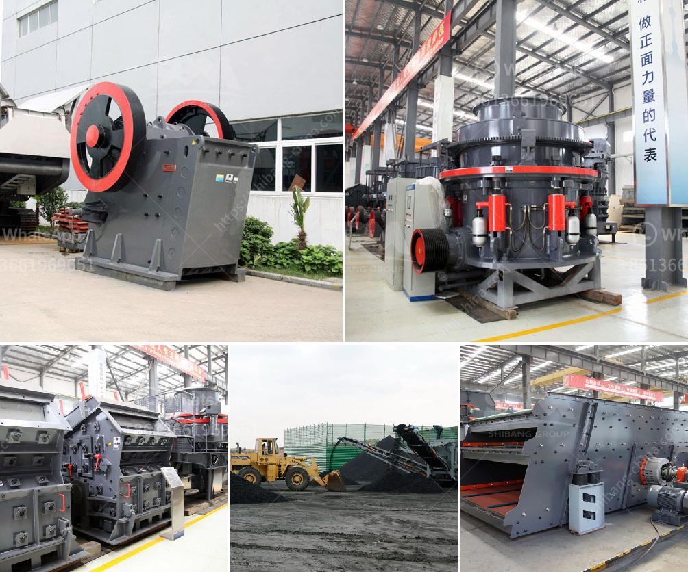

<h3>double roller crusher advantages</h3>
Double roller crusher, also known as roll crusher, is commonly used in mining, chemical industry, cement, metallurgy, building materials and other industries. It is mainly used for crushing medium-hardness materials and brittle ore. It has advantages such as small footprint, compact structure, strong reliability, and convenient maintenance.

Double roller crusher is equipped with two crushing rollers. The distance between the two rollers can be adjusted to produce the desired particle size. The materials after being crushed fall onto the vibrating screen, and the qualified materials will be discharged, while the oversized materials will be sent back to the crusher for further crushing. This process ensures the final product size is uniform.

One of the major advantages of double roller crusher is its capability to produce a narrow particle size distribution. Thus, minimizing the production of undesired product sizes. The smooth roll crusher offers a smooth and grooved roller surface which operates at a fixed distance between the rollers. This significantly reduces the chance of clogging and jamming the machine, especially when handling tough and sticky materials, which are more often the case in mineral processing applications.

Double roller crusher also has the advantage of handling wet, sticky materials. Although the particles are not crushed into powder, they are still mixed in the form of mud, which strengthens the work of the crushing roller. The machine is also beneficial for reducing dust emissions and wear and tear on surrounding equipment.

Moreover, double roller crusher has low energy consumption. Compared with other types of crushers, it uses crushing instead of grinding to produce particles, which reduces the wear of the equipment and reduces energy consumption.

In conclusion, double roller crusher has the advantages of small footprint, compact structure, strong reliability, convenient maintenance, low energy consumption, and uniform particle size distribution. It is an ideal crushing equipment in the mining industry.
<h3>Contact us</h3><ul><li><strong>Whatsapp:&nbsp;<a href="https://wa.me/8613661969651">+8613661969651</a></strong></li><li><a href="https://swt.shibang-china.com/?git&amp;zhl&amp;double roller crusher advantages"><strong>Online Service(chat now)</strong></a></li></ul><h3>Related</h3><ul><li><a href='grinding machines for brick.md'>grinding machines for brick</a></li><li><a href='stone principle crusher project.md'>stone principle crusher project</a></li><li><a href='gold wash plant for sale in brazil.md'>gold wash plant for sale in brazil</a></li><li><a href='objectives of ball mill.md'>objectives of ball mill</a></li><li><a href='project report on concrete crusher pdf.md'>project report on concrete crusher pdf</a></li></ul>