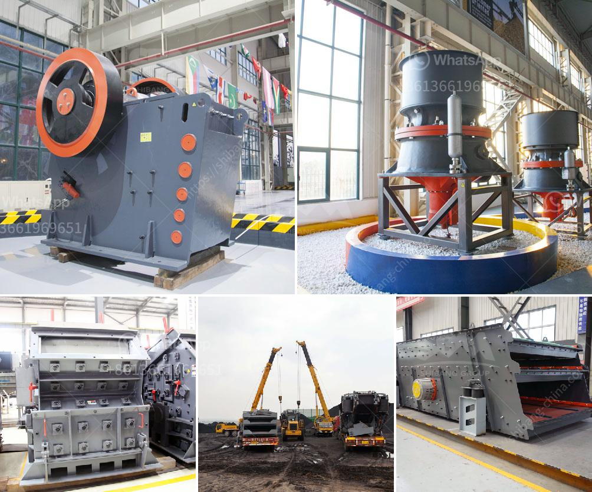

<h3>drums of conveyor belts malaysia</h3>
Conveyor belts are an integral part of modern industrial processes, facilitating the seamless movement of goods and materials within factories, mines, and other industrial facilities. At the heart of these conveyor belts are the drums, which play a critical role in ensuring the efficiency, reliability, and durability of the entire system. In Malaysia, drums of conveyor belts are highly sought after due to their high-quality and exceptional performance in various industries.

The drums of conveyor belts serve as the driving force, powering the movement of the belts and ensuring proper tension. These drums are typically made of sturdy and durable materials such as steel or aluminum, capable of withstanding heavy loads, constant rotations, and harsh operating conditions. In Malaysia, manufacturers specialize in producing high-quality drums that meet international standards, ensuring optimal performance and longevity.

One key aspect that sets drums of conveyor belts in Malaysia apart is their ability to withstand extreme heat, humidity, and corrosive environments. Malaysia's tropical climate, with its high temperatures and humidity levels, poses a significant challenge to industrial machinery. Conveyor belts equipped with drums specifically designed for such conditions can operate smoothly and reliably with minimal maintenance requirements, reducing downtime and boosting overall productivity.

Additionally, Malaysia's industrial landscape includes sectors like mining, oil and gas, and palm oil production, which expose conveyor systems to abrasive materials, chemicals, and other contaminants. The drums of conveyor belts designed and manufactured in Malaysia are often equipped with specialized coatings or linings that offer superior resistance to abrasion and corrosion. These protective features significantly extend the service life of the drums, reducing the need for frequent replacements and associated costs.

Another noteworthy aspect of drums of conveyor belts in Malaysia is their adaptability to various conveyor configurations and requirements. Malaysia's diverse industrial sectors demand customized solutions to address specific operational needs. Conveyor belt drum manufacturers in Malaysia are known for their flexibility and ability to design and produce drums that fit seamlessly into existing conveyor systems or cater to unique layouts and specifications. This adaptability ensures efficient material handling and smooth operations, regardless of the industry or application.

With the efficient and reliable performance of drums of conveyor belts in Malaysia, industries can benefit from increased productivity, reduced operational costs, and improved worker safety. Efficient material handling promotes a streamlined production process, minimizing bottlenecks and maximizing throughput. Moreover, the robust construction and high-quality materials used in Malaysian drum production guarantee the safety of workers, preventing accidents and injuries.

In conclusion, drums of conveyor belts in Malaysia are an essential component of industrial processes, offering various advantages such as heat and corrosion resistance, adaptability, and durability. These drums are designed to withstand challenging operating conditions, delivering reliable performance and reducing maintenance requirements. With their exceptional quality and performance, Malaysian drums of conveyor belts play a vital role in improving efficiency, productivity, and safety across various industries.
<h3>Contact us</h3><ul><li><strong>Whatsapp:&nbsp;<a href="https://wa.me/8613661969651">+8613661969651</a></strong></li><li><a href="https://swt.shibang-china.com/?git&amp;zhl&amp;drums of conveyor belts malaysia"><strong>Online Service(chat now)</strong></a></li></ul><h3>Related</h3><ul><li><a href='slag peralatan pabrik vertikal.md'>slag peralatan pabrik vertikal</a></li><li><a href='roller mill sizes.md'>roller mill sizes</a></li><li><a href='limestone crusher india.md'>limestone crusher india</a></li><li><a href='limestone crusher equipment.md'>limestone crusher equipment</a></li><li><a href='quotation ball mill.md'>quotation ball mill</a></li></ul>