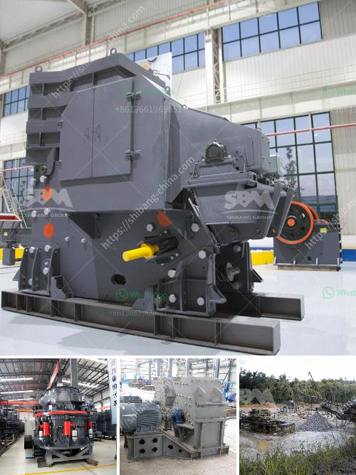

<h3>dry process of cement manufacturing</h3>
The dry process of cement manufacturing refers to the method of producing cement without adding water to the raw materials. Nowadays, there are two different methods used for cement production, namely dry and wet processes. The dry process usually utilizes lime stone, coal, clay and iron ore to produce cement clinker in a continuous operation process. However, the wet process is conducted in rotary kilns where the raw materials are ground, mixed, and fed into the kiln system in the form of slurry.

The dry process has significantly evolved over the last century, thanks to the advancements in technology. With the adoption of modern techniques, plants can now produce a substantial amount of cement in less time while maintaining high quality.

The dry process takes place in three main steps: preparation of raw materials, blending and grinding of materials, and finally, the clinker formation. In the first step, the raw materials are fed into the kiln system to produce powdered lime stone, coal, clay, and iron ore. The second step involves mixing these raw materials in a specific proportion and grinding them into fine powder, which is then stored in silos. The final step is where the clinker is formed by heating the powder mixture in a rotary kiln at high temperatures.

One of the main advantages of the dry process is that it utilizes less energy compared to the wet process. This is due to the fact that water is not added in the grinding and blending stage, eliminating the need for additional energy to evaporate the water. This makes the dry process more cost-effective and environmentally friendly.

Moreover, the dry process allows for greater control over the production process. The raw materials can be precisely measured and proportioned to achieve the desired composition, resulting in consistent quality. Additionally, the dry process eliminates the risk of water-related issues, such as the formation of condensation and the corrosion of machinery.

Another advantage of the dry process is its flexibility in using different types of fuels. The kiln system in the dry process can easily adapt to alternative fuels such as coal, petroleum coke, or even waste materials. This not only helps in reducing the carbon footprint but also provides the opportunity for using less expensive and more sustainable energy sources.

However, it is important to note that the dry process requires more technical expertise and higher initial investment compared to the wet process. The dry process plants have to be carefully engineered and designed while considering the specific characteristics of the raw materials used.

In conclusion, the dry process of cement manufacturing is an efficient and widely adopted method with numerous benefits. Its ability to utilize different types of fuels, low energy consumption, and precise control over the production process have made it a popular choice in the industry. With continuous advancements in technology, the dry process is expected to further evolve and contribute to sustainable cement production in the future.
<h3>Contact us</h3><ul><li><strong>Whatsapp:&nbsp;<a href="https://wa.me/8613661969651">+8613661969651</a></strong></li><li><a href="https://swt.shibang-china.com/?git&amp;zhl&amp;dry process of cement manufacturing"><strong>Online Service(chat now)</strong></a></li></ul><h3>Related</h3><ul><li><a href='used gold washer machine plant.md'>used gold washer machine plant</a></li><li><a href='balls in cement grinding.md'>balls in cement grinding</a></li><li><a href='calcium bromide manufacturing process.md'>calcium bromide manufacturing process</a></li><li><a href='gold processing plant dry.md'>gold processing plant dry</a></li><li><a href='how to buy brick crushing machine from bangladesh.md'>how to buy brick crushing machine from bangladesh</a></li></ul>