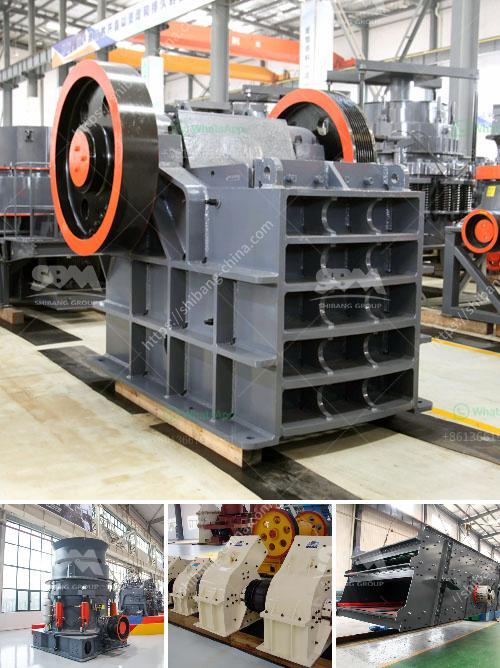

<h3>enquiry rock crusher</h3>
The constant advancements in technology have revolutionized various industries, and the construction sector is no exception. One such technological marvel that has been gaining popularity in recent years is the enquiry rock crusher. This innovative machine is designed to break down large rocks into smaller, more manageable stones, making it an essential tool for any construction project.

The enquiry rock crusher operates on the principle of compression force. It utilizes a hydraulic piston that applies immense pressure to the rocks, causing them to break down into smaller pieces. This powerful crushing mechanism is not only efficient but also time-saving, allowing construction crews to complete their tasks in a shorter period.

One of the most significant advantages of the enquiry rock crusher is its versatility. It can handle a wide range of rock materials, including limestone, granite, and even concrete debris. Such flexibility makes it an ideal choice for various construction projects, from road construction to building foundations.

Moreover, the enquiry rock crusher is equipped with advanced features to ensure optimal safety and efficiency. It includes a dust extraction system that minimizes the release of harmful particles into the air, reducing the risk of respiratory problems for the workers. Additionally, it has an automatic lubrication system that ensures smooth operation and minimizes downtime for maintenance.

The accessibility of the enquiry rock crusher is another factor that contributes to its popularity. It is compact and can be transported to different job sites easily. This mobility allows construction companies to save both time and money by eliminating the need for multiple crushers at various locations.

In conclusion, the enquiry rock crusher is a technological marvel that has transformed the construction industry. Its ability to break down large rocks into smaller stones efficiently and safely makes it an indispensable tool for construction projects of all sizes. With its versatility, advanced features, and ease of mobility, it is no wonder that the enquiry rock crusher has become an essential component in every construction crew's arsenal.
<h3>Contact us</h3><ul><li><strong>Whatsapp:&nbsp;<a href="https://wa.me/8613661969651">+8613661969651</a></strong></li><li><a href="https://swt.shibang-china.com/?git&amp;zhl&amp;enquiry rock crusher"><strong>Online Service(chat now)</strong></a></li></ul><h3>Related</h3><ul><li><a href='how to calculate the powder conveying rate.md'>how to calculate the powder conveying rate</a></li><li><a href='manufacturing process of talcum powder.md'>manufacturing process of talcum powder</a></li><li><a href='iron ore crusher in mexico.md'>iron ore crusher in mexico</a></li><li><a href='stone medina stone mobile crusher.md'>stone medina stone mobile crusher</a></li><li><a href='roller stone crusher.md'>roller stone crusher</a></li></ul>