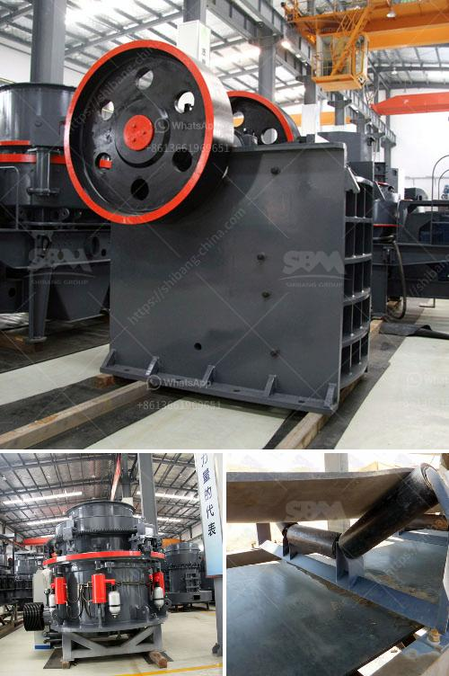

<h3>equipment cost for silica sand mining</h3>
Silica sand, also known as industrial sand, is one of the most abundant minerals on Earth and an essential component in various industries. It is widely used in the production of glass, ceramics, metal casting, and hydraulic fracturing, among others. As the demand for silica sand continues to rise, so does the need for efficient and cost-effective mining equipment to extract this valuable resource. In this article, we will explore the equipment cost involved in silica sand mining.

One of the main considerations in any mining operation is the cost of acquiring the necessary equipment. With advancements in technology, there are several types of equipment available for silica sand mining, each with varying costs and capabilities. Let's take a closer look at these equipment options:

1. Excavators: Excavators are large, heavy-duty machines used to remove overburden and extract the silica sand. These machines have a high production capacity, making them suitable for large-scale mining operations. However, excavators come with a hefty price tag, ranging from a few hundred thousand to several million dollars, depending on their size and capabilities.

2. Front-end loaders: Front-end loaders, also known as wheel loaders, are commonly used in smaller-scale mining operations. These machines are versatile and can handle various tasks, including digging, loading, and hauling. The cost of front-end loaders ranges from tens of thousands to a few hundred thousand dollars, depending on their size and features.

3. Conveyors: Conveyors are essential for transporting silica sand from the mining site to the processing plant. They are cost-effective and highly efficient, reducing the need for manual labor and minimizing the risk of material loss or contamination. Conveyor systems can be custom-built to suit the specific requirements of the mining operation, with costs ranging from a few thousand to several hundred thousand dollars.

4. Crushing equipment: Silica sand often needs to be crushed before it can be processed further. This is where crushing equipment comes into play. Crushers are used to break down the larger silica sand particles into smaller, more manageable sizes. The cost of crushing equipment can vary significantly, depending on factors such as the capacity, power source, and type of crushers used.

5. Screening equipment: After the silica sand has been crushed, it needs to be screened to ensure uniform particle size distribution. Screening equipment, such as vibrating screens or rotary trommel screens, can be used for this purpose. The cost of screening equipment varies depending on factors such as the size, capacity, and features.

In addition to the initial purchase cost, there are other ongoing expenses associated with equipment for silica sand mining. These include maintenance, repairs, fuel, and labor costs. Proper maintenance and timely repairs are crucial to ensure the longevity and efficiency of the equipment, which can add to the overall cost.

It is also important to consider the environmental impact of silica sand mining and the need for appropriate mitigation measures. Compliance with regulatory requirements, such as dust control systems and reclamation plans, can add to the equipment cost in some cases. Nonetheless, investing in environmentally responsible practices is essential for the long-term sustainability of the mining operation.

In conclusion, the cost of equipment for silica sand mining can vary significantly depending on the scale of the operation, the specific needs and requirements, and the type of equipment chosen. It is crucial for mining companies to carefully evaluate their options and consider factors such as production capacity, efficiency, and environmental impact to make informed decisions that ensure cost-effectiveness and sustainability in the long run.
<h3>Contact us</h3><ul><li><strong>Whatsapp:&nbsp;<a href="https://wa.me/8613661969651">+8613661969651</a></strong></li><li><a href="https://swt.shibang-china.com/?git&amp;zhl&amp;equipment cost for silica sand mining"><strong>Online Service(chat now)</strong></a></li></ul><h3>Related</h3><ul><li><a href='limestone belt conveyor.md'>limestone belt conveyor</a></li><li><a href='gypsum ball mill manufacturing machine.md'>gypsum ball mill manufacturing machine</a></li><li><a href='complete iron ore processing plant cost.md'>complete iron ore processing plant cost</a></li><li><a href='start a quarry plant.md'>start a quarry plant</a></li><li><a href='rock crushing plant.md'>rock crushing plant</a></li></ul>