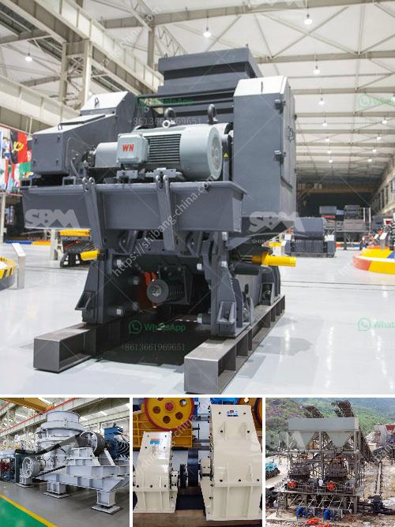

<h3>equipment costs for cement plant</h3>
A cement plant is a significant investment, requiring careful planning and consideration of various factors. One of the crucial aspects to consider when setting up a cement manufacturing plant is the cost of equipment. From raw material processing to storing and packaging, the machinery required for cement production can be expensive. In this article, we will delve into the various equipment costs associated with a cement plant.

Quarrying refers to the process of extracting raw materials like limestone, clay, or shale from the earth's crust. Heavy-duty excavators, loaders, and dump trucks are essential for efficient extraction. Depending on the scale of operations, the cost can range from hundreds of thousands to millions of dollars.

After extraction, raw materials need to be crushed and ground to a specific size. Crushers, such as jaw crushers and impact crushers, reduce the size of the extracted materials. Grinding equipment, such as ball mills or vertical roller mills, further pulverizes the crushed materials. The cost of such machinery can vary greatly, depending on the capacity and specifications.

The kiln is the heart of a cement plant, where raw materials are heated to high temperatures. Rotary kilns and preheaters ensure the efficient combustion of fuels and the formation of clinker. These systems involve significant capital investment due to their sheer size and complexity. Costs can exceed millions of dollars depending on the kiln's capacity and fuel requirements.

Cement plants require ample storage capacity for raw materials, intermediate products such as clinker, and the final cement product. Silos, covered storage domes, or warehouses are necessary for efficient storage. The cost of storage equipment can vary based on the capacity and type of storage required.

Packaging and loading equipment are essential for the final stage of cement production. Bagging machines, palletizers, and loaders ensure efficient packaging and loading onto trucks or railcars for transportation. The investment cost of packaging and loading equipment will depend on the production capacity and the type of packaging required.

Cement plants need to comply with strict environmental regulations, which necessitate the installation of pollution control devices. Dust collectors, electrostatic precipitators, and scrubbers are employed to reduce emissions and ensure the plant meets environmental standards. The cost of pollution control devices can be significant, and it is essential to factor them into the overall equipment costs.

In addition to the primary equipment mentioned above, various auxiliary systems are required for the smooth operation of a cement plant. This includes power supply infrastructure, water treatment systems, material handling equipment, conveyors, and compressors. These costs need to be included while estimating the overall investment required for the cement plant.

It is essential to note that equipment costs are just one aspect of the overall investment required for a cement plant. Other factors, such as land acquisition, permits, labor, and operational costs, should also be considered. Conducting a comprehensive feasibility study and seeking expert advice will help in better estimating the equipment costs and planning the budget for a cement plant project.
<h3>Contact us</h3><ul><li><strong>Whatsapp:&nbsp;<a href="https://wa.me/8613661969651">+8613661969651</a></strong></li><li><a href="https://swt.shibang-china.com/?git&amp;zhl&amp;equipment costs for cement plant"><strong>Online Service(chat now)</strong></a></li></ul><h3>Related</h3><ul><li><a href='semi industrial stone crusher.md'>semi industrial stone crusher</a></li><li><a href='stone crusher plant in kenya.md'>stone crusher plant in kenya</a></li><li><a href='gold ore mining equipment companies in germany.md'>gold ore mining equipment companies in germany</a></li><li><a href='raymond mill parts.md'>raymond mill parts</a></li><li><a href='mica pearl process flowchart.md'>mica pearl process flowchart</a></li></ul>