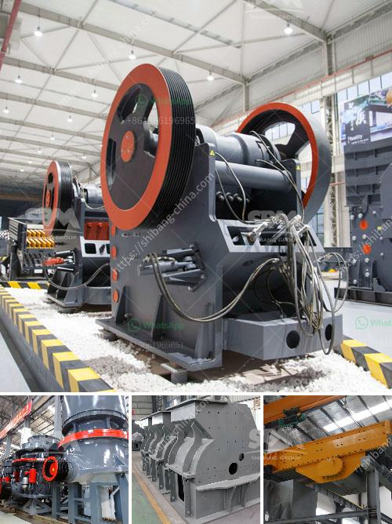

<h3>equipment design of coal washing plant</h3>
Coal washing is an essential process for the efficient utilization of coal, removing impurities and reducing ash to improve its quality. The equipment design of a coal washing plant plays a crucial role in the overall process, ensuring optimum separation efficiency while delivering a high-quality end product.

One of the main components of a coal washing plant is the dense medium cyclone, which is used to separate coal from the impurities based on their specific gravity. The dense medium cyclone consists of a cylindrical section with an inlet at the top and an outlet at the bottom. The mixture of coal and water, known as the suspension, is fed into the cyclone, where the dense medium separation takes place. The heavier material, primarily coal, settles at the bottom while the lighter impurities, such as rock and clay, are discharged through the overflow. The design of the dense medium cyclones involves optimizing the inlet and outlet geometry to minimize losses of coal with the overflow and ensure efficient separation.

To further enhance the coal washing process, the plant may incorporate additional equipment such as a spiral concentrator and froth flotation cells. The spiral concentrator uses gravity to separate coal particles based on their density, allowing for a more precise separation of high- and low-density particles. This helps in achieving a cleaner coal product with reduced ash content.

Froth flotation, on the other hand, exploits the differences in wettability between coal particles and impurities. In this process, a mixture of pulverized coal and water is agitated with small amounts of soap or other flotation agents. Air is then injected into the slurry, causing the coal particles to attach to the air bubbles and rise to the top as froth, while the unwanted impurities remain in the water. The froth is then skimmed off and dried, yielding a high-quality coal concentrate. The design of the froth flotation cells includes factors such as bubble size, air flow rate, and agitation to optimize the separation efficiency.

In addition to the core equipment mentioned above, a coal washing plant may include various auxiliary equipment such as screens, crushers, and magnetic separators. Screens are used to separate coal into different sizes, allowing for precise control of the coal feed to the dense medium cyclone and spiral concentrator. Crushers are employed to reduce the size of the coal before it enters the washing plant, ensuring efficient processing. Magnetic separators, on the other hand, are used to remove magnetic impurities from the coal, such as pyrite, which can cause corrosion in coal-fired power plants.

The design of a coal washing plant with a capacity of 300-500 tons per hour should take into account the specific requirements of the coal preparation process, site conditions, and environmental regulations. It should also aim to maximize the recovery of coal while minimizing the production of waste materials and controlling emissions. A well-designed coal washing plant not only improves the quality of the coal product but also reduces environmental impacts, making it an essential component of the coal industry.
<h3>Contact us</h3><ul><li><strong>Whatsapp:&nbsp;<a href="https://wa.me/8613661969651">+8613661969651</a></strong></li><li><a href="https://swt.shibang-china.com/?git&amp;zhl&amp;equipment design of coal washing plant"><strong>Online Service(chat now)</strong></a></li></ul><h3>Related</h3><ul><li><a href='sample business plan for crushed stone.md'>sample business plan for crushed stone</a></li><li><a href='the process of cement making with ball mills.md'>the process of cement making with ball mills</a></li><li><a href='ball mill in hindi.md'>ball mill in hindi</a></li><li><a href='quartz stone powder mill.md'>quartz stone powder mill</a></li><li><a href='crawler type mobile crusher.md'>crawler type mobile crusher</a></li></ul>