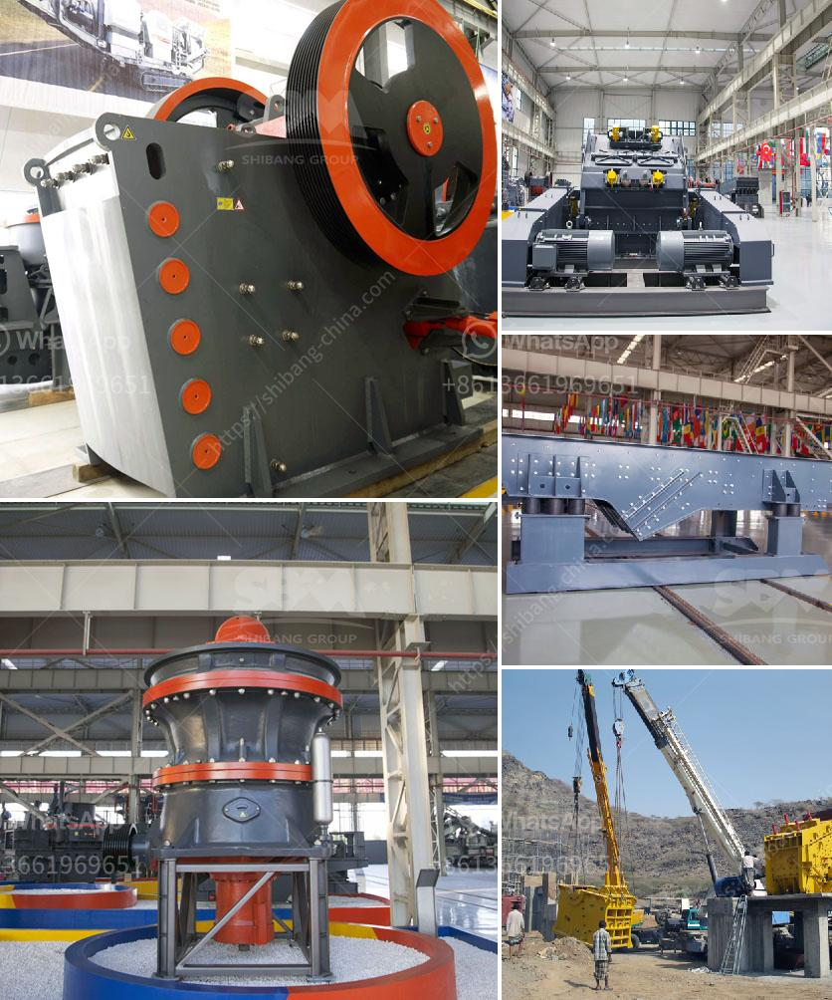

<h3>equipment for a mini quarry plant</h3>
Mini quarry plants play a crucial role in meeting the increasing demand for construction materials. These small-scale operations are highly efficient and cost-effective alternatives to large quarrying operations. However, to maximize productivity and ensure smooth operations, it is essential to invest in the right equipment for a mini quarry plant.

Excavators are among the primary tools used in any quarrying operation, whether big or small. For a mini quarry plant, compact excavators with the appropriate bucket size are preferable. These machines are versatile and can be used for various tasks, such as digging, loading, and transporting materials. Mini excavators are designed to work efficiently in tight spaces, making them ideal for small-scale operations where there may be spatial constraints.

Crushers are an essential component of any quarry plant. When it comes to mini quarry plants, mobile crushers are highly advantageous. They allow for on-site crushing, eliminating the need to transport materials to a stationary crusher. Due to their compact size and ease of mobility, these crushers can be easily moved around the quarry, saving time and reducing logistical complexities. Mobile crushers are available in various sizes and configurations, enabling mini quarry plants to select the ideal crusher for their specific requirements.

Conveyors are vital equipment for efficient material handling within a quarry. For a mini quarry plant, portable conveyors offer flexibility and convenience. These conveyors can be quickly set up and dismantled, making them suitable for temporary operations. Portable conveyors also eliminate the need for manual material transportation, saving labor costs and reducing the risk of injuries. They can transport various materials, including crushed stone, sand, and gravel, with ease.

Screening equipment is essential for separating different sizes of materials and ensuring the quality of the final products. Mini quarry plants can benefit from portable screening plants that offer mobility and versatility. These plants can be easily transported from one location to another within the quarry, allowing for efficient screening of materials on-site. Portable screening plants come with various screen sizes and configurations, catering to the specific needs of mini quarry plants.

Dust control equipment is crucial for maintaining a safe and healthy working environment within a quarry. Dust suppression systems are highly recommended for mini quarry plants to ensure the well-being of workers and prevent the dispersion of dust particles into the surrounding area. The most common types of dust control systems include misting cannons, water sprays, and fogging systems. These systems help reduce airborne dust, improving air quality and minimizing health risks.

Maintaining and repairing equipment is crucial to minimize downtime and increase productivity. Mini quarry plants should invest in a well-equipped maintenance and repair facility. This facility should include basic tools, spare parts, and a designated workspace for conducting routine maintenance and necessary repairs. Having skilled technicians on-site or readily available assists in addressing equipment issues promptly, ensuring uninterrupted operations.

In conclusion, investing in the right equipment is essential for the success of a mini quarry plant. Excavators, crushers, conveyors, screening equipment, dust control systems, and proper maintenance facilities are essential components for enhanced efficiency and productivity. By selecting equipment that is specifically designed for small-scale operations, mini quarry plants can optimize their operations, meet increasing demands, and contribute to the construction industry's growth.
<h3>Contact us</h3><ul><li><strong>Whatsapp:&nbsp;<a href="https://wa.me/8613661969651">+8613661969651</a></strong></li><li><a href="https://swt.shibang-china.com/?git&amp;zhl&amp;equipment for a mini quarry plant"><strong>Online Service(chat now)</strong></a></li></ul><h3>Related</h3><ul><li><a href='vertical mill calcium.md'>vertical mill calcium</a></li><li><a href='stone crusher conveyor belts.md'>stone crusher conveyor belts</a></li><li><a href='gravel pebbles mining south africa.md'>gravel pebbles mining south africa</a></li><li><a href='cone crushers made in italy.md'>cone crushers made in italy</a></li><li><a href='process of coal crushing plant.md'>process of coal crushing plant</a></li></ul>