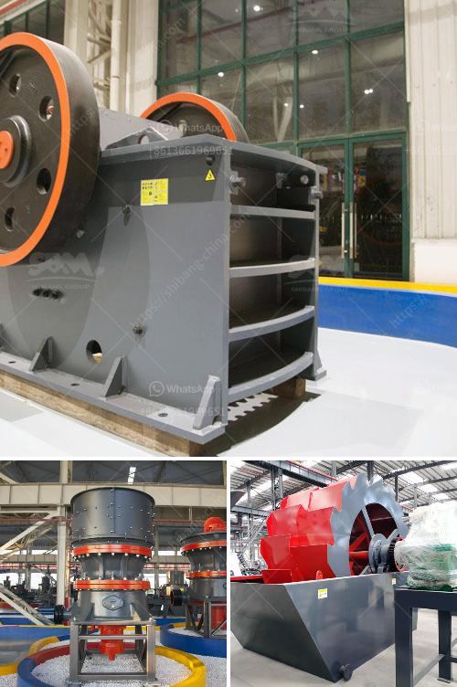

<h3>equipment for the production of vermiculite</h3>
Vermiculite is a versatile and highly sought-after mineral known for its remarkable properties, including its excellent insulation capabilities, lightweight nature, and fire resistance. It is widely used in various industries, such as agriculture, construction, and horticulture. Vermiculite production requires specialized equipment to ensure high-quality and efficient processing. In this article, we will explore the equipment used in the production of vermiculite.

One of the key pieces of equipment used in vermiculite production is the vermiculite exfoliation furnace. This furnace is responsible for expanding the raw vermiculite material through a controlled heat process called exfoliation. The furnace contains a chamber where the material is heated to a high temperature, usually around 900-1000 degrees Celsius. As the vermiculite is heated, it expands rapidly, forming lightweight, worm-like structures. This process is essential to produce the characteristic expanded vermiculite that is widely used in various applications.

Another crucial equipment is the vermiculite screening machine. After the vermiculite is expanded, it needs to be sorted and classified based on different particle sizes. The screening machine typically consists of multiple decks or layers with varying mesh sizes. The expanded vermiculite is fed onto the top of the machine and moves across the decks, where the smaller particles fall through the mesh openings, while the larger particles continue their journey. This process ensures the uniformity of the vermiculite particles, making them suitable for different applications, such as insulation or soil amendment.

Additionally, the vermiculite processing line requires a mill or grinder. This equipment is used to reduce the expanded vermiculite into the desired particle size, ensuring consistency and enhancing its usability. The mill or grinder can be equipped with various types of grinding media to suit the specific requirements of the production process. The ground vermiculite can then be packaged and transported for further use or distribution.

Furthermore, a dust collection system is essential in vermiculite production. As the material is processed and moved through different stages, it can generate fine dust particles, which may pose health and safety risks. A well-designed and efficient dust collection system helps capture and contain these particles, ensuring a clean and safe working environment. The system typically consists of industrial-grade filters, air purifiers, and ductwork that effectively capture and remove the dust particles.

In conclusion, the production of vermiculite involves several specialized equipment pieces to ensure the efficient and high-quality processing of the mineral. The vermiculite exfoliation furnace, screening machine, mill or grinder, and dust collection system are vital components in this process. These equipment not only facilitate the expansion and classification of vermiculite but also enhance its usability and safety. With the right equipment in place, producers can meet the growing demand for vermiculite across various industries and continue to explore new applications for this versatile mineral.
<h3>Contact us</h3><ul><li><strong>Whatsapp:&nbsp;<a href="https://wa.me/8613661969651">+8613661969651</a></strong></li><li><a href="https://swt.shibang-china.com/?git&amp;zhl&amp;equipment for the production of vermiculite"><strong>Online Service(chat now)</strong></a></li></ul><h3>Related</h3><ul><li><a href='crushers i want to build a crusher.md'>crushers i want to build a crusher</a></li><li><a href='ball mill machine price.md'>ball mill machine price</a></li><li><a href='price of roller crushers in usa.md'>price of roller crushers in usa</a></li><li><a href='manufacturer crusher machines contacts.md'>manufacturer crusher machines contacts</a></li><li><a href='mobile stone crusher price india.md'>mobile stone crusher price india</a></li></ul>