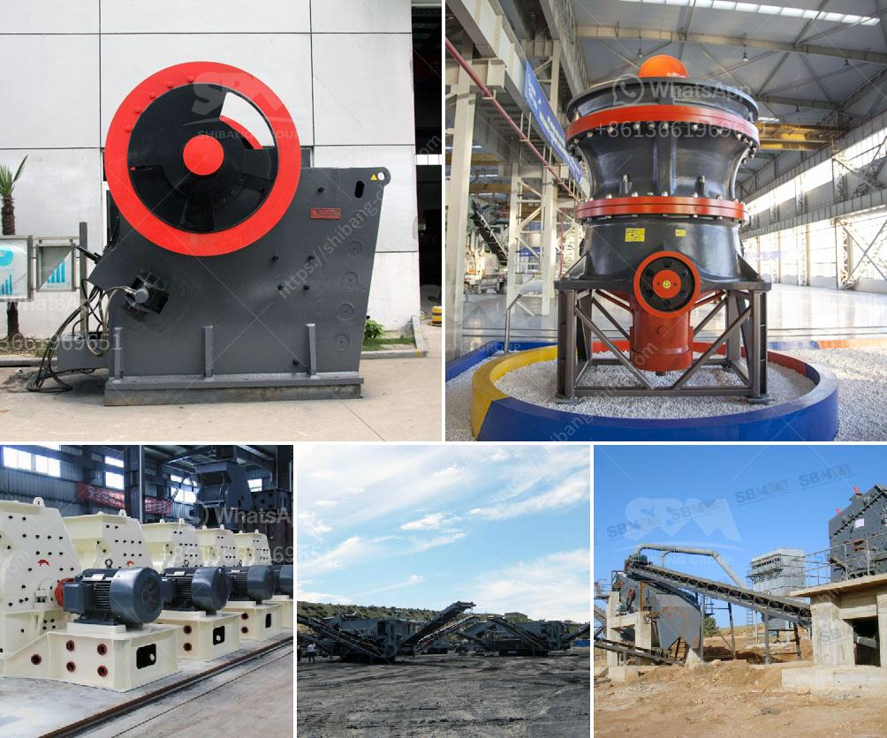

<h3>equipment needed for quarry crusher</h3>
Quarrying is a tedious and labor-intensive activity that involves the extraction of valuable stones and minerals from the earth's surface. The process requires heavy equipment to crush and grind large rocks into finer pieces that can be further processed for various applications. Among the crucial pieces of machinery used in a quarry crusher are the loaders, conveyors, crushers, and screens.

Loaders play a crucial role in moving the extracted rocks and materials from one place to another within the quarry site. These robust machines are specifically designed to handle heavy loads and operate in challenging terrains. They have a bucket at the front that can scoop up large quantities of rocks and materials, making it easier to transport them to the crusher.

Conveyors are another important piece of equipment used in a quarry crusher. They are responsible for efficiently transporting the material from the primary crusher to the secondary and tertiary crushers. Conveyors can be operated manually or automatically, depending on the quarry's requirements. They come in various lengths and widths to accommodate different production capacities.

Crushers are the workhorses of the quarrying industry. These powerful machines are used to break down large rocks into smaller, more manageable sizes. There are various types of crushers available on the market, including jaw crushers, cone crushers, and impact crushers. Each type has its own unique features and benefits, making them suitable for different applications.

Screens are essential in separating different sizes of crushed materials. They ensure that only the required size of materials goes through for further processing, while the oversize rocks are sent back to the crusher for a secondary pass. Screens can be designed with different deck configurations to cater to specific size requirements.

In conclusion, a quarry crusher relies on a range of equipment to effectively extract, crush, and process rocks and materials. Loaders, conveyors, crushers, and screens are all vital components that work together to ensure a productive and efficient quarry operation. Investing in high-quality equipment and maintaining them regularly can significantly increase the overall productivity and profitability of a quarry.
<h3>Contact us</h3><ul><li><strong>Whatsapp:&nbsp;<a href="https://wa.me/8613661969651">+8613661969651</a></strong></li><li><a href="https://swt.shibang-china.com/?git&amp;zhl&amp;equipment needed for quarry crusher"><strong>Online Service(chat now)</strong></a></li></ul><h3>Related</h3><ul><li><a href='brick making machine in zimbabwe.md'>brick making machine in zimbabwe</a></li><li><a href='crushing and grinding processes of platinum.md'>crushing and grinding processes of platinum</a></li><li><a href='limestone crushing plant manufacturer.md'>limestone crushing plant manufacturer</a></li><li><a href='forno paragon para venda.md'>forno paragon para venda</a></li><li><a href='ball mill machine price.md'>ball mill machine price</a></li></ul>