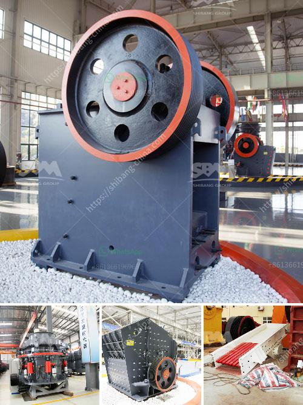

<h3>equipment use in the mining of laterite</h3>
Mining plays a crucial role in various industries, including construction, manufacturing, and infrastructure development. As technology advances, the mining sector continuously seeks efficient and cost-effective methods to extract valuable minerals from the earth's crust. Among the many minerals extracted, laterite stands as a significant resource due to its abundance and diverse applications.

Laterite is a type of soil composed of iron and aluminum-rich materials, commonly found in tropical regions. One of its primary uses is as a source of nickel, an essential component in the production of stainless steel and rechargeable batteries. As the demand for nickel and other minerals found in laterite increases, so does the need for advanced equipment and techniques to extract and process this valuable resource.

To maximize the efficiency and productivity of laterite mining operations, specialized equipment is utilized to handle the unique characteristics of this soil type. Here, we discuss some of the essential tools and machinery used in laterite mining:

1. Excavators: These heavy-duty machines are commonly used in surface mining operations. Excavators are equipped with buckets that can dig into the earth, removing large quantities of laterite soil. Their versatility and high digging capacity make them ideal for removing overburden materials.

2. Bulldozers: Efficient earthmoving equipment, bulldozers are employed to clear and level the mining site, clearing vegetation and soft soil layers. This allows easier access for mining equipment and enhances safety during operations.

3. Rotary Drills: Laterite can be deeply embedded in the ground, requiring the use of rotary drills to access the mineral deposit. These powerful drills bore into the earth, enabling sampling, data collection, and extraction techniques.

4. Hauling Trucks: Once laterite is extracted from the site, hauling trucks transport the soil to the processing plant. These trucks are designed to carry heavy loads efficiently, reducing transportation costs and minimizing environmental impact.

5. Crushers and Grinders: At the processing plant, crushers and grinders reduce the laterite into smaller, manageable sizes. This crushing process enhances the mineral's surface area, making it easier to extract the desired metals during subsequent processing steps.

6. Separation Equipment: Various separation techniques are employed to extract valuable minerals from laterite. Magnetic separators, froth flotation cells, and gravity concentrators separate nickel and other minerals from the soil matrix, allowing for the recovery of these valuable resources.

7. Drying and Roasting Equipment: Depending on the desired end product, laterite may undergo drying and roasting processes. These steps remove excess moisture, eliminate impurities, and enhance the mineral's properties for specific applications.

The use of advanced equipment in laterite mining has several advantages. First, it improves overall operational efficiency by accelerating both the extraction and processing phases. This reduces costs and increases productivity, resulting in a quicker return on investment for mining companies. Additionally, specialized equipment minimizes the environmental impact of laterite mining operations. It enables precise excavation, reducing the disturbance of surrounding ecosystems and minimizing soil erosion.

In conclusion, the mining of laterite requires the utilization of specialized equipment to extract and process its valuable minerals efficiently. Equipment such as excavators, bulldozers, rotary drills, hauling trucks, crushers, grinders, separation units, and drying and roasting systems play crucial roles in the overall mining process. As the demand for laterite minerals continues to rise, it is essential for mining companies to invest in advanced equipment to enhance efficiency, productivity, and sustainability in their operations.
<h3>Contact us</h3><ul><li><strong>Whatsapp:&nbsp;<a href="https://wa.me/8613661969651">+8613661969651</a></strong></li><li><a href="https://swt.shibang-china.com/?git&amp;zhl&amp;equipment use in the mining of laterite"><strong>Online Service(chat now)</strong></a></li></ul><h3>Related</h3><ul><li><a href='how to make a ball crusher.md'>how to make a ball crusher</a></li><li><a href='single stage hammer crusher hot sale.md'>single stage hammer crusher hot sale</a></li><li><a href='for crushing plant permit philippines.md'>for crushing plant permit philippines</a></li><li><a href='small stone crusher in kenya.md'>small stone crusher in kenya</a></li><li><a href='stone crush machine price in pakistan.md'>stone crush machine price in pakistan</a></li></ul>