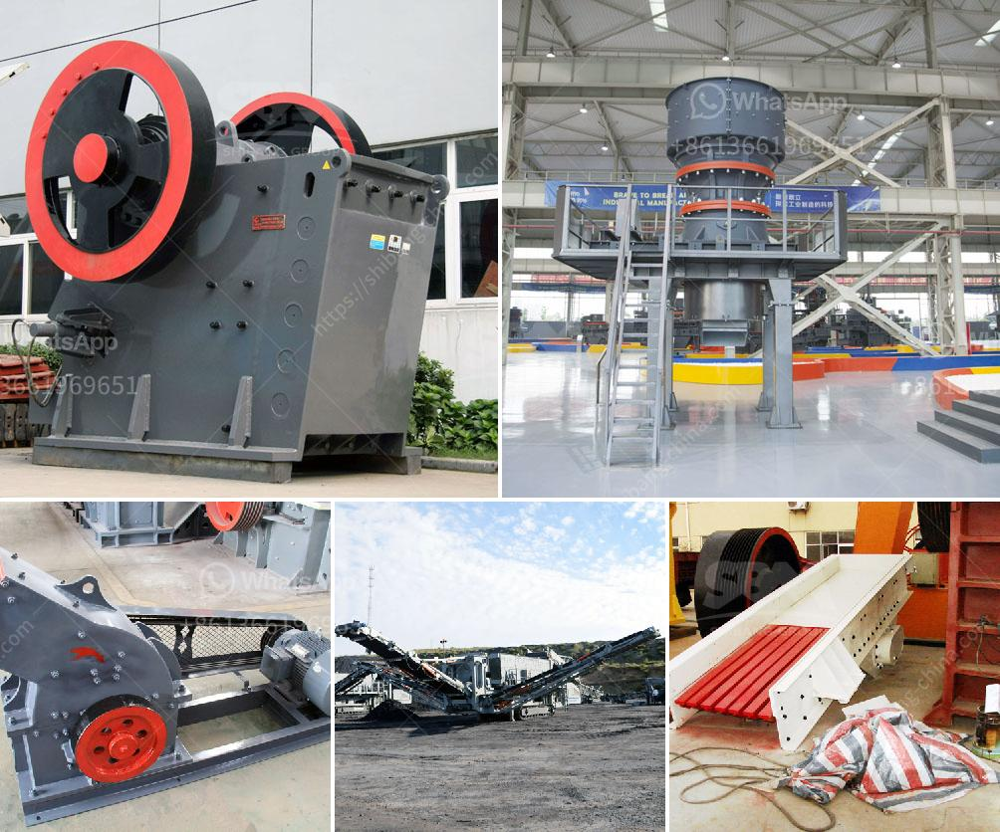

<h3>equipment used in open pit copper ore mining plant</h3>
Open pit mining is a technique used to extract copper ore near the surface of the earth. This method uses large-scale machinery to remove the ore and accompanying waste rock in one continuous operation. In the open pit copper ore mining plant, various types of equipment are widely used, including extraction and transportation equipment and beneficiation equipment. The main extraction equipment includes drilling and blasting equipment, electric shovels or hydraulic excavators, and large-diameter drill rigs, while the beneficiation equipment mainly includes crushers, ball mills, magnetic separators, flotation machines, and concentrators.

Drilling and blasting equipment is necessary to break up the solid rock face and create openings for excavation. This equipment typically includes rotary drills, which bore holes into the rock, and explosives, which are inserted into the holes and detonated to break the rock into smaller fragments. The broken rock is then loaded onto haul trucks for transportation to the crushing plant.

Electric shovels or hydraulic excavators are widely used in open pit mining operations due to their ability to remove large quantities of material efficiently. These machines are equipped with buckets that can dig up to several cubic meters of rock and transport it to trucks waiting for loading. The size and capacity of the machines depend on the scale of the operation, with larger mining projects requiring larger and more powerful equipment.

Large-diameter drills are used to create holes for blasting in hard rock formations. These drills are capable of drilling holes with diameters ranging from several inches to several feet, depending on the size of the rock fragment desired. The drilling process involves inserting a drill bit into the rock face and rotating it to create the hole. Water or drilling mud is used to cool and lubricate the drilling process and remove the cuttings from the hole.

Once the ore has been removed from the mine, it undergoes crushing and grinding processes to reduce its size and liberate the copper minerals for further processing. Crushers, ball mills, and magnetic separators are used to break down the ore into smaller particles and separate the copper minerals from the waste rock.

Flotation machines and concentrators are then used to separate and concentrate the copper minerals from the gangue material. Flotation is a process in which the finely ground ore is mixed with water and chemicals, creating a froth on the surface that carries the copper minerals to the top, while the gangue sinks to the bottom. The froth is collected and further processed to produce copper concentrate, which can be smelted to produce pure copper metal.

In conclusion, open pit copper ore mining plant uses a variety of equipment to efficiently extract and process copper ore near the surface of the earth. Large-scale equipment is employed to remove the ore and waste rock, which is then crushed and ground to liberate the copper minerals. Further processing separates the copper concentrate from the gangue material, resulting in the production of pure copper metal. As mining operations continue to evolve, new technologies and advancements in equipment are being introduced to improve efficiency and sustainability in the industry.
<h3>Contact us</h3><ul><li><strong>Whatsapp:&nbsp;<a href="https://wa.me/8613661969651">+8613661969651</a></strong></li><li><a href="https://swt.shibang-china.com/?git&amp;zhl&amp;equipment used in open pit copper ore mining plant"><strong>Online Service(chat now)</strong></a></li></ul><h3>Related</h3><ul><li><a href='second hand mobile coal washing plant.md'>second hand mobile coal washing plant</a></li><li><a href='calcium carbonate factory costs.md'>calcium carbonate factory costs</a></li><li><a href='ball mill to buy in peru.md'>ball mill to buy in peru</a></li><li><a href='cost gypsum processing machines.md'>cost gypsum processing machines</a></li><li><a href='application of vertical grinding machine.md'>application of vertical grinding machine</a></li></ul>