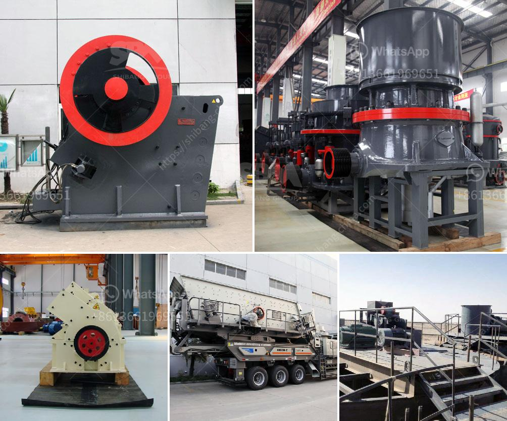

<h3>estimated cost of setting up a quarry</h3>
The quarry is a significant investment project. The location, quality, and quantity of stone reserves are the foremost considerations for estimating the cost to set up a quarry.

However, other factors also play a key role in determining the final construction budget. These include the technology and machinery required, the size of the quarry site, the infrastructure needs, and the environmental impact assessments. In this article, we will discuss the estimated costs involved in setting up a quarry.

The first step is to identify the suitable location for the quarrying operation. This requires extensive research and surveys to ensure that the site is rich in high-quality stone reserves. Geological experts are usually hired to assess the area and estimate the quantity and quality of the stone. Additionally, legal and environmental considerations must be evaluated before acquiring the necessary permits. The cost of this initial research and survey can range from $20,000 to $40,000.

Once the location is finalized, the next step is to acquire the necessary equipment and machinery for mining and processing the stone. This can include large excavators, bulldozers, crushers, conveyor belts, and screening machines. The cost of these machines can vary widely depending on their size, capacity, and brand. On average, a medium-sized quarry operation may require an investment of around $1.5 million to $3 million.

Infrastructure development is another major cost factor. This includes constructing access roads, setting up electricity and water supply systems, and building workshops and storage facilities. The extent of infrastructure development depends on the size of the quarry site and the proximity to existing roads and utilities. The estimated cost of infrastructure development can range from $500,000 to $1 million.

Environmental regulations and sustainability practices should also be considered. Quarry operations often require environmental assessments and reclamation plans to minimize their impact on the surrounding ecosystem. This may involve hiring specialized consultants and investing in reforestation or restoration projects. The cost of environmental assessments and sustainability measures can add up to $50,000 to $100,000 to the overall budget.

Furthermore, operational costs need to be factored in. Energy costs, maintenance fees, labor wages, and fuel expenses should be considered for a comprehensive estimate. These costs will vary depending on the scale of the quarry and the efficiency of the machinery. On average, operational costs can range from $100,000 to $500,000 per year.

In conclusion, setting up a quarry can be a substantial investment project. The estimated cost will depend on various factors such as the size of the quarry, the quality of stone reserves, the required technology and machinery, and the infrastructure needs. Additionally, environmental assessments and operational costs should be considered for an accurate budget estimation. While the initial investment may seem high, a well-operated quarry can yield substantial profits in the long run.
<h3>Contact us</h3><ul><li><strong>Whatsapp:&nbsp;<a href="https://wa.me/8613661969651">+8613661969651</a></strong></li><li><a href="https://swt.shibang-china.com/?git&amp;zhl&amp;estimated cost of setting up a quarry"><strong>Online Service(chat now)</strong></a></li></ul><h3>Related</h3><ul><li><a href='coal grinding plant.md'>coal grinding plant</a></li><li><a href='used ball mills philippines.md'>used ball mills philippines</a></li><li><a href='setup for limestone crusher plant.md'>setup for limestone crusher plant</a></li><li><a href='sand in washing machine.md'>sand in washing machine</a></li><li><a href='ball mill capacity for clay.md'>ball mill capacity for clay</a></li></ul>