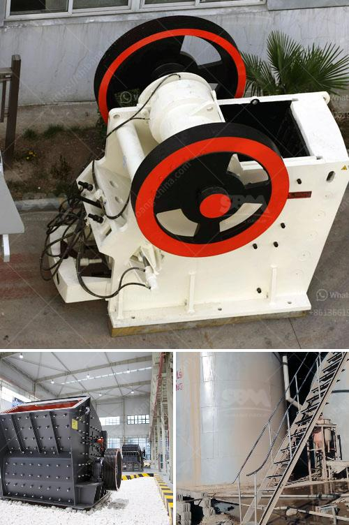

<h3>european jaw crusher</h3>
The European jaw crusher is a new type of jaw crusher developed by our company after traditional jaw crusher. This product is a perfect combination of modern science and technology and the production practice, which can better satisfy the automatic production demands of vast customers.

Compared with traditional jaw crusher, this product has higher capacity and more stable performance. Its crushing ratio is large and the product granularity is even. It has wide application and can meet the requirements of different customers. Furthermore, it is equipped with hydraulic device, which makes the whole machine more convenient to operate and maintain.

This European jaw crusher is an ideal choice for crushing materials with high hardness and abrasion resistance. It can process various ores using compressive strength less than 320MPa. The structure design is compact, the machine body is small and narrow, which makes it easy to transport and install.

In addition, this jaw crusher has a simple structure, reliable operation and low operating costs. The unique "V" shaped crushing chamber design greatly improves the crushing efficiency and the finished product has a uniform particle size. The discharging port of this equipment is adjustable, so it can meet the different needs of customers.

In conclusion, the European jaw crusher is an advanced and efficient crushing machine with wide application. It is suitable for various materials with high hardness and abrasion resistance. With its compact structure and simple operation, it is favored by many customers in the mining industry.
<h3>Contact us</h3><ul><li><strong>Whatsapp:&nbsp;<a href="https://wa.me/8613661969651">+8613661969651</a></strong></li><li><a href="https://swt.shibang-china.com/?git&amp;zhl&amp;european jaw crusher"><strong>Online Service(chat now)</strong></a></li></ul><h3>Related</h3><ul><li><a href='dolomite grinding machines suppliers in india.md'>dolomite grinding machines suppliers in india</a></li><li><a href='conveyor belts for buckets.md'>conveyor belts for buckets</a></li><li><a href='cement clinker grinding manufacturer.md'>cement clinker grinding manufacturer</a></li><li><a href='services nigeria conveyor machine.md'>services nigeria conveyor machine</a></li><li><a href='manufacturing processes of clay products.md'>manufacturing processes of clay products</a></li></ul>