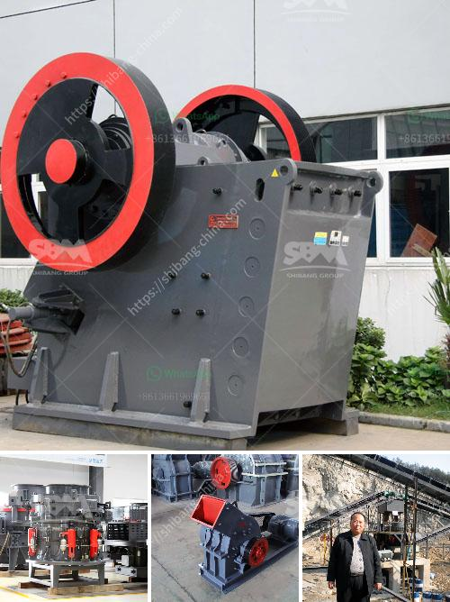

<h3>famous manganese cone crusher parts made in luoyang china</h3>
When it comes to crushing equipment, cone crushers are one of the most sought-after types of machinery in the mining industry. Known for their ability to crush hard, abrasive ores and rocks, cone crushers are utilized in countless applications across various industries.

One integral component of a cone crusher that plays a crucial role in its operation is the manganese cone crusher parts. These parts are responsible for crushing the material within the crushing chamber and ensuring efficient performance. And when it comes to high-quality manganese cone crusher parts, Luoyang in China is the place to go.

Luoyang, located in the Henan province of China, is renowned for its heavy machinery manufacturing industry. With a rich history dating back thousands of years, Luoyang has established itself as a significant player in the production of mining equipment and parts. In particular, it has gained global recognition for its manganese cone crusher parts.

The manganese cone crusher parts manufactured in Luoyang excel in their durability and reliability. Made from high-quality materials, these parts are designed to withstand the harshest conditions and resist wear and tear. Whether it is for primary, secondary, or tertiary cone crushers, the manganese cone crusher parts produced in Luoyang are known to maximize the crusher's efficiency and output.

Furthermore, the cutting-edge technology used in the manufacturing process ensures that the parts meet international quality standards. Each part undergoes rigorous testing, including hardness and impact resistance tests, to ensure optimal performance and longevity. This commitment to quality has earned Luoyang a reputation as a leading manufacturer of manganese cone crusher parts.

In addition to their excellent performance, manganese cone crusher parts made in Luoyang are often more cost-effective than their counterparts. Thanks to the city's renowned heavy machinery industry and efficient production processes, Luoyang has managed to offer competitive prices without compromising on quality. This has made their parts attractive to customers worldwide who seek both reliability and affordability.

In conclusion, famous manganese cone crusher parts made in Luoyang, China, are highly sought-after in the mining industry. With their superior quality, durability, and affordability, these parts have become the top choice for cone crushers worldwide. As Luoyang continues to innovate and refine its manufacturing processes, it is undoubtedly set to maintain its position as a global leader in producing exceptional manganese cone crusher parts.
<h3>Contact us</h3><ul><li><strong>Whatsapp:&nbsp;<a href="https://wa.me/8613661969651">+8613661969651</a></strong></li><li><a href="https://swt.shibang-china.com/?git&amp;zhl&amp;famous manganese cone crusher parts made in luoyang china"><strong>Online Service(chat now)</strong></a></li></ul><h3>Related</h3><ul><li><a href='crushing plant price list.md'>crushing plant price list</a></li><li><a href='granite quarry crusher in nigeria.md'>granite quarry crusher in nigeria</a></li><li><a href='crusher stone peru.md'>crusher stone peru</a></li><li><a href='pakistan fabricated silica sand washing plant.md'>pakistan fabricated silica sand washing plant</a></li><li><a href='crusher plant for sale.md'>crusher plant for sale</a></li></ul>