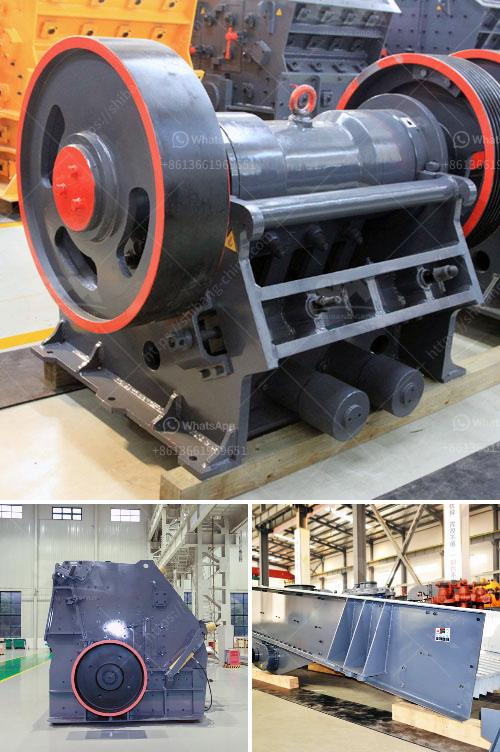

<h3>feasibility study for stone crusher plants</h3>
A crushing plant is a machine that is used in the construction industry to reduce the size of rocks and gravel. These machines can be categorized into two types; stationary machines and mobile machines. The stationary machines are usually used for producing aggregates, whereas the mobile ones are used for extracting minerals. These machines are used in various sectors such as mining, infrastructure development, and highway construction.

Before setting up a stone crushing plant, it is necessary to conduct a feasibility study to determine whether the plant can pay back the investment and yield profits or not. The feasibility study includes several sections, such as the executive summary, introduction, project background, analysis of market, analysis of production, analysis of sales, and conclusion. Each section aims to provide a comprehensive understanding of the project's viability.

The executive summary provides a brief overview of the entire feasibility study. It highlights the key findings and recommendations. The introduction section provides a background of the stone crushing industry, such as the technical aspects, geographical location, and market trends. The project background section explains the reason for conducting the feasibility study and the significance of the stone crushing plant.

The analysis of market section evaluates the demand and supply of crushed stones in the target market. It includes information on the potential customers, their preferences, and the competitive landscape. The production analysis section assesses the equipment, machinery, and raw materials required for the stone crushing plant. It also looks into the operational processes involved, such as crushing, screening, and washing.

The sales analysis section estimates the revenue generation potential of the stone crushing plant. It includes calculations on the selling price, expected sales volume, and market share. Other factors, such as marketing strategies, distribution channels, and pricing policies, are also taken into consideration.

In conclusion, a feasibility study for stone crusher plants is essential to evaluate the financial viability of the project. It provides information on the market, production, sales, and investment needed to make a decision whether to invest or not. Conducting a thorough feasibility study can help project owners make an informed decision and avoid potential risks.
<h3>Contact us</h3><ul><li><strong>Whatsapp:&nbsp;<a href="https://wa.me/8613661969651">+8613661969651</a></strong></li><li><a href="https://swt.shibang-china.com/?git&amp;zhl&amp;feasibility study for stone crusher plants"><strong>Online Service(chat now)</strong></a></li></ul><h3>Related</h3><ul><li><a href='mobile crushers in abuja.md'>mobile crushers in abuja</a></li><li><a href='talcum powder suppliers factories.md'>talcum powder suppliers factories</a></li><li><a href='used gold washer machine plant.md'>used gold washer machine plant</a></li><li><a href='stone crushers in kenya.md'>stone crushers in kenya</a></li><li><a href='kaolin grinding plant manufacturer in india.md'>kaolin grinding plant manufacturer in india</a></li></ul>