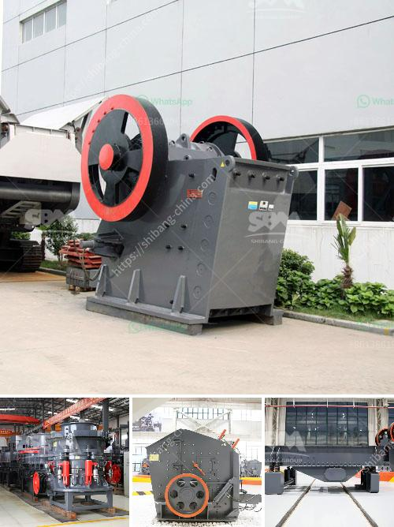

<h3>feasibility study on barite milling plants</h3>
Barite, also known as baryte, is a non-metallic mineral found abundantly in natural deposits. It is commonly used as a weighting agent in drilling fluids and as a filler in various industries, such as plastics, rubber, and ceramics. With a global demand for barite consistently on the rise, there is a growing need for the establishment of barite milling plants to meet this demand.

A feasibility study is a crucial step in determining the viability of setting up a barite milling plant. This study assesses various key factors, such as market demand, cost implications, technical requirements, and regulatory constraints, to gauge the overall feasibility of the project. Let's delve into the important aspects explored during a feasibility study on barite milling plants.

Market demand plays a pivotal role in determining the potential success of a barite milling plant. The study analyzes the current and forecasted demand for barite and its derivatives in various sectors, such as oil and gas drilling, paints and coatings, and pharmaceuticals. Factors that influence market demand, including environmental regulations, industry trends, and economic conditions, are taken into account to assess the long-term sustainability of the plant.

Cost implications encompass an array of factors that affect the financial viability of a barite milling plant. The study examines the capital investment required for setting up the plant, including land, machinery, equipment, and infrastructure. Operational costs, such as labor, energy consumption, raw material procurement, and maintenance, are also thoroughly evaluated. Additionally, the study considers the potential revenue generation and profitability of the plant by analyzing pricing dynamics and market competition.

Technical requirements focus on the machinery and processes necessary for efficiently milling barite into various forms, such as powders or granules. The study investigates the available milling technologies, their efficiency, maintenance requirements, and environmental impact. It also examines the suitability of the chosen location for the plant by considering factors like water availability, power supply, and logistics. Compliance with applicable health, safety, and environmental regulations is another critical aspect evaluated in this section.

Regulatory constraints are imperative to ensure legal compliance and mitigate potential risks associated with operating a barite milling plant. The study explores the local, national, and international regulations governing the extraction, processing, and transportation of barite. Environmental regulations, waste management guidelines, and permits are carefully examined to ensure adherence to legal requirements. In addition, the study assesses any potential geopolitical risks that may impact the establishment and operation of the plant.

In conclusion, a feasibility study on barite milling plants is essential to determine if the project is viable from technical, economic, and regulatory perspectives. It provides valuable insights into market demand, cost implications, technical requirements, and regulatory constraints. By thoroughly analyzing these factors, decision-makers can make informed choices about investment in barite milling plants and contribute to meeting the global demand for this versatile mineral.
<h3>Contact us</h3><ul><li><strong>Whatsapp:&nbsp;<a href="https://wa.me/8613661969651">+8613661969651</a></strong></li><li><a href="https://swt.shibang-china.com/?git&amp;zhl&amp;feasibility study on barite milling plants"><strong>Online Service(chat now)</strong></a></li></ul><h3>Related</h3><ul><li><a href='to calculate cost of limestone production in mining.md'>to calculate cost of limestone production in mining</a></li><li><a href='mining and quarrying crusher business in south africa.md'>mining and quarrying crusher business in south africa</a></li><li><a href='recycled concrete crusher.md'>recycled concrete crusher</a></li><li><a href='cebu rock crusher.md'>cebu rock crusher</a></li><li><a href='ball mill calcium carbonat.md'>ball mill calcium carbonat</a></li></ul>