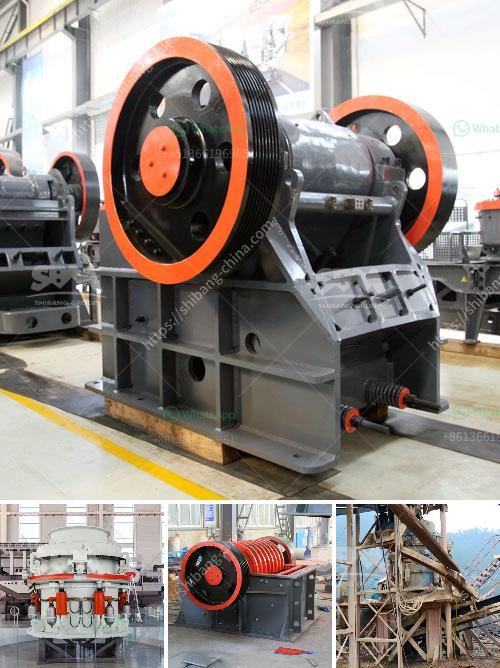

<h3>feldspar beneficiation plant</h3>
Feldspar is one of the most abundant minerals found in the earth's crust. It is a major rock-forming mineral that exists in igneous, metamorphic, and sedimentary rocks. Feldspar can be categorized into two main types, which are alkali feldspar and plagioclase feldspar.

Due to its versatile nature and widespread usage, feldspar has become an essential raw material in various industries such as ceramics, glass, and paints. However, not all feldspar deposits are suitable for immediate use. Some deposits contain impurities and require beneficiation processes to improve their quality and remove unwanted materials.

A feldspar beneficiation plant is a facility specially designed to process feldspar-rich deposits. Beneficiation plants perform a series of separate processes, including crushing, grinding, screening, magnetic separation, and flotation, to produce feldspar concentrates of the desired quality. These concentrates are used in various applications, depending on their specific properties and composition.

The primary goal of a feldspar beneficiation plant is to eliminate impurities and achieve the highest possible quality of feldspar concentrate. This is done by utilizing different techniques that exploit the physical and chemical properties of feldspar and associated minerals. For instance, magnetic separation is commonly used to remove iron-bearing impurities, while flotation is utilized to separate feldspar from quartz and other gangue minerals.

The implementation of a feldspar beneficiation plant requires careful planning and engineering. Factors such as the deposit's characteristics, desired concentrate quality, and market demand should be taken into account. Additionally, environmental considerations and sustainability principles should guide the design and operation of the plant to minimize the potential impact on the surrounding ecosystem.

Overall, feldspar beneficiation plants play a crucial role in meeting the growing demands for high-quality feldspar in various industries. By upgrading feldspar-rich deposits, these plants contribute to the availability of a valuable raw material, reducing the reliance on imports and promoting domestic production. Furthermore, the beneficiation process helps to optimize the utilization of mineral resources and minimize waste generation, thus enhancing the sustainability of the mining industry.
<h3>Contact us</h3><ul><li><strong>Whatsapp:&nbsp;<a href="https://wa.me/8613661969651">+8613661969651</a></strong></li><li><a href="https://swt.shibang-china.com/?git&amp;zhl&amp;feldspar beneficiation plant"><strong>Online Service(chat now)</strong></a></li></ul><h3>Related</h3><ul><li><a href='ball mill quartz.md'>ball mill quartz</a></li><li><a href='ball grinding mill.md'>ball grinding mill</a></li><li><a href='bentonite pulverizer ball mill in gujrat.md'>bentonite pulverizer ball mill in gujrat</a></li><li><a href='quarry crusher zimbabwe.md'>quarry crusher zimbabwe</a></li><li><a href='mills for limestone in bolivia.md'>mills for limestone in bolivia</a></li></ul>