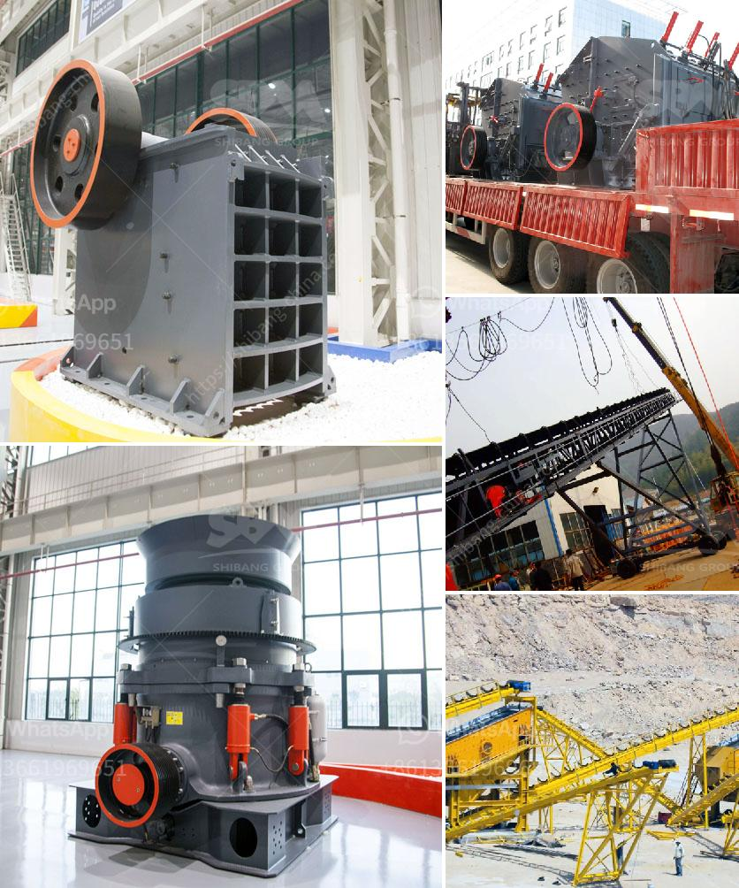

<h3>feldspar crusher equipment</h3>
Feldspar is a term used to describe a group of minerals that contain aluminum and silica. These minerals are mainly found in igneous rocks, particularly in the form of granite. Feldspar is widely used in various industries, such as ceramic, glass, and paint manufacturing, as well as in the production of electrical equipment and appliances.

To make use of these minerals, it is essential to extract them from the ground and then process them into a usable form. This is where feldspar crusher equipment comes into play. The purpose of a feldspar crusher is to break large rocks into smaller pieces to facilitate transportation and further processing. The machine has a sturdy construction and is designed to withstand heavy workloads and high temperatures.

There are several types of feldspar crushers, including jaw crusher, cone crusher, and impact crusher. Each type has its own features and advantages, making them suitable for different crushing applications. In order to choose the most appropriate crusher equipment, it is necessary to carefully consider several factors, such as the hardness, moisture content, and size of the feldspar rocks.

Jaw crushers are known for their ability to crush hard and abrasive ores and rocks, making them ideal for primary crushing. However, they may not be suitable for all feldspar crushing applications due to their relatively large size and high power consumption. Cone crushers, on the other hand, are more versatile and can handle a wider range of materials. They are often used for secondary and tertiary crushing of feldspar rocks.

Impact crushers are designed to create a high amount of impact force on materials. They are particularly useful for crushing soft and medium-hard materials, such as feldspar. Although most of the time they are used as primary crushers, they can also be used as secondary or tertiary crushers depending on the application.

In addition to the type of crusher equipment, the selection of the crushing chamber also has a significant impact on the final product. Different types of crushing chambers, such as standard, medium, and short head, can be selected according to the size of the feldspar particles and the required output size.

Furthermore, the speed of the crusher rotor and the adjustable speed control device can be used to control the particle size of the final product. By adjusting the speed, it is possible to achieve a finer or coarser desired particle size.

It is worth mentioning that the feldspar crusher equipment provided by different manufacturers may vary in terms of quality and performance. Therefore, it is necessary to compare the technical parameters and prices of different machines to choose the most suitable one.

In conclusion, feldspar crusher equipment plays an important role in the feldspar processing line. The equipment is designed to break large rocks into smaller pieces to facilitate transportation and further processing. The different types of crushers are suitable for different crushing applications and can be selected according to the specific requirements of the feldspar industry.
<h3>Contact us</h3><ul><li><strong>Whatsapp:&nbsp;<a href="https://wa.me/8613661969651">+8613661969651</a></strong></li><li><a href="https://swt.shibang-china.com/?git&amp;zhl&amp;feldspar crusher equipment"><strong>Online Service(chat now)</strong></a></li></ul><h3>Related</h3><ul><li><a href='companies selling mining equipment.md'>companies selling mining equipment</a></li><li><a href='crusher machine vendor in penang.md'>crusher machine vendor in penang</a></li><li><a href='mini cement plant for sale in south africa.md'>mini cement plant for sale in south africa</a></li><li><a href='german grinding mill manufacturer.md'>german grinding mill manufacturer</a></li><li><a href='cost of setting up a kaolin production plant.md'>cost of setting up a kaolin production plant</a></li></ul>