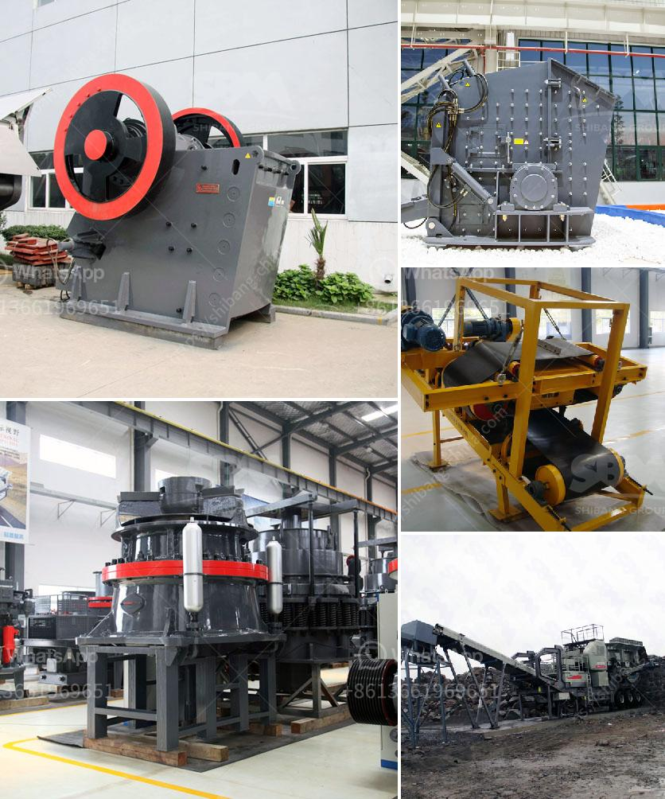

<h3>feldspar production plant</h3>
Feldspar is one of the most abundant minerals found on Earth and plays a vital role in various industries, especially ceramics. It is a key ingredient in the production of glass, ceramics, and porcelain, providing strength, durability, and resistance to high temperatures. As the demand for ceramics continues to rise, the need for efficient and sustainable feldspar production plants becomes increasingly crucial.

A feldspar production plant is a facility that extracts feldspar from the earth and processes it into a usable form. The plant uses various techniques such as crushing, grinding, and milling to transform the raw material into a fine powder or granules, which are then used in ceramic manufacturing processes.

Efficiency is a key aspect of any feldspar production plant. To ensure maximum productivity, these plants employ advanced machinery and technology. For instance, high-performance crushers and grinding mills are used to crush and grind the raw feldspar, reducing processing time and increasing output.

Moreover, many production plants incorporate automated systems and computerized controls to monitor and manage the various processes. This not only improves efficiency but also reduces the risk of human error and ensures consistent quality in the final product. For example, automated material handling systems facilitate the movement of feldspar throughout the plant, minimizing manual labor and streamlining the production flow.

In recent years, sustainability has become a major concern for industries worldwide, including ceramics. Feldspar production plants have taken steps to minimize their impact on the environment. For instance, many plants have invested in energy-efficient equipment and technologies to reduce their carbon footprint. Energy-efficient crushers and mills, as well as advanced filtration systems, are utilized to conserve resources and lower emissions.

Additionally, water recycling and reuse systems are implemented in feldspar production plants to minimize water consumption and waste. By treating and reusing process water, these facilities significantly reduce their environmental impact and contribute to a more sustainable future.

Furthermore, proper waste management and disposal strategies are employed in these plants. By implementing recycling programs and ensuring proper handling of waste materials, feldspar production plants reduce landfill waste and promote a circular economy.

Beyond efficiency and sustainability, feldspar production plants also prioritize quality control. This is crucial to ensure that the final product meets the strict requirements of the ceramic industry. Continuous monitoring and testing are conducted throughout the production process to assess the quality and consistency of the feldspar.

Overall, feldspar production plants play a critical role in supplying the ceramic industry with a key raw material. With a focus on efficiency, sustainability, and quality control, these plants are striving to meet the growing demand for ceramics while minimizing their environmental impact.

As the ceramics industry continues to evolve, innovation and advancements in feldspar production plants will undoubtedly shape its future. From utilizing advanced machinery to adopting sustainable practices, these plants are paving the way for an efficient and environmentally conscious ceramic manufacturing process.
<h3>Contact us</h3><ul><li><strong>Whatsapp:&nbsp;<a href="https://wa.me/8613661969651">+8613661969651</a></strong></li><li><a href="https://swt.shibang-china.com/?git&amp;zhl&amp;feldspar production plant"><strong>Online Service(chat now)</strong></a></li></ul><h3>Related</h3><ul><li><a href='different between the mill and hammer crusher.md'>different between the mill and hammer crusher</a></li><li><a href='small scale mining partnership crusher.md'>small scale mining partnership crusher</a></li><li><a href='calcium carbonate proses by process.md'>calcium carbonate proses by process</a></li><li><a href='malaysia stone crusher price.md'>malaysia stone crusher price</a></li><li><a href='dolomite grinding machines suppliers in india.md'>dolomite grinding machines suppliers in india</a></li></ul>