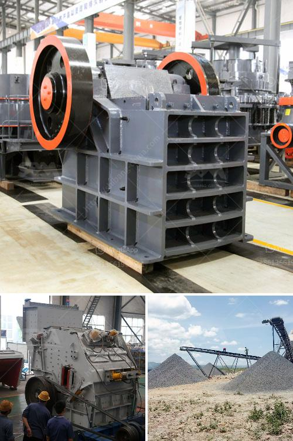

<h3>feldspar raymond mill grinding mill in low price</h3>
Feldspar is a kind of common minerals that is found in various geological environments. It is widely used in ceramics, glass, and other industries. Raymond mill is a commonly used grinding equipment in the milling industry.

Raymond mill is suitable for grinding feldspar, calcite, talc, barite, fluorite, rare earth, marble, bauxite, manganese ore, iron ore, copper ore, etc. The fineness of finished products can be adjusted arbitrarily between 0.18mm-0.044mm.

The new generation of Raymond mill developed by Clirik is an ideal equipment for grinding feldspar. The equipment has high grinding efficiency, low energy consumption, large conveying capacity, reasonable and compact structure, stable and reliable performance, and can effectively enhance the overall competitiveness in the market.

One of the key advantages of this Raymond mill is its low price. Compared with other mills on the market, the cost of the new Raymond mill is reduced by more than 30% on average, which makes the grinding mill more affordable for customers. At the same time, the quality and performance of the mill are guaranteed, ensuring a good user experience.

1. Multi-function: The grinding mill can handle a wide range of materials, including feldspar, calcite, talc, barite, fluorite, etc.

2. High grinding efficiency: The advanced grinding principle makes the fineness of finished products even and fine, and the capacity is increased by more than 40% compared with traditional Raymond mills.

3. Environmentally friendly: The Raymond mill is equipped with a pulse dust collector, which effectively eliminates dust pollution and meets environmental protection requirements.

4. Easy maintenance: The Raymond mill is equipped with a number of patented technologies, which greatly reduces maintenance time and improves equipment durability.

In summary, the feldspar Raymond mill provided by Clirik is a professional grinding mill equipment with low price and high grinding efficiency. It is an ideal milling equipment for processing feldspar. If you are interested in this equipment, please feel free to contact us for more details.
<h3>Contact us</h3><ul><li><strong>Whatsapp:&nbsp;<a href="https://wa.me/8613661969651">+8613661969651</a></strong></li><li><a href="https://swt.shibang-china.com/?git&amp;zhl&amp;feldspar raymond mill grinding mill in low price"><strong>Online Service(chat now)</strong></a></li></ul><h3>Related</h3><ul><li><a href='feldspar vsi crusher.md'>feldspar vsi crusher</a></li><li><a href='100 ton per day cement making plant.md'>100 ton per day cement making plant</a></li><li><a href='feldspar crusher equipment.md'>feldspar crusher equipment</a></li><li><a href='mobile crusher plant for sale.md'>mobile crusher plant for sale</a></li><li><a href='carbonate from barite manufacturing process.md'>carbonate from barite manufacturing process</a></li></ul>