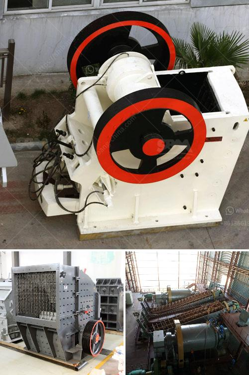

<h3>feldspar refining and processing equipment</h3>
Feldspar is a popular choice for a variety of industries due to its abundant reserves, widespread distribution, and versatile properties. However, before it can be used in various applications, feldspar needs to undergo a refining and processing process to eliminate impurities and enhance its quality. This is where feldspar refining and processing equipment comes into play.

Feldspar refining and processing equipment mainly include jaw crusher, ball mill, magnetic separator, hydrocyclone, flotation machine, and other auxiliary equipment. The specific process flow varies depending on different types and grades of feldspar ore. However, in most cases, the basic process includes crushing, grinding, desliming, magnetic separation, flotation, and dewatering.

Firstly, the raw feldspar ore is crushed to the required size by a jaw crusher. Then, it is finely ground by a ball mill to obtain feldspar powder. The ground powder is further classified by a hydrocyclone or desliming machine to remove impurities like clay and other minerals. Magnetic separation is often employed to eliminate magnetic minerals from the feldspar ore. In some cases, flotation is used to separate feldspar from other non-metallic minerals. Finally, dewatering equipment is utilized to remove excess water from the final product.

The feldspar refining and processing equipment mentioned above are essential for the efficient extraction and purification of feldspar. They help to maximize the yield, improve the quality, and reduce the environmental impact of the process. Advanced technologies and equipment are continuously being developed to further enhance the efficiency and sustainability of feldspar refining and processing.

In conclusion, feldspar refining and processing equipment play a crucial role in the production of high-quality feldspar products. With proper equipment and process optimization, feldspar can be purified and processed to meet the specific requirements of various industries, such as ceramics, glass, electrical appliances, and more. The continuous advancement in refining and processing technology will continue to drive the growth of the feldspar industry, making it a valuable resource for numerous applications.
<h3>Contact us</h3><ul><li><strong>Whatsapp:&nbsp;<a href="https://wa.me/8613661969651">+8613661969651</a></strong></li><li><a href="https://swt.shibang-china.com/?git&amp;zhl&amp;feldspar refining and processing equipment"><strong>Online Service(chat now)</strong></a></li></ul><h3>Related</h3><ul><li><a href='specification of jaw crusher.md'>specification of jaw crusher</a></li><li><a href='ball mill south africa.md'>ball mill south africa</a></li><li><a href='manufacturing process of mica crusher.md'>manufacturing process of mica crusher</a></li><li><a href='crusehr processing plant malaysia.md'>crusehr processing plant malaysia</a></li><li><a href='quartz stone crushing process.md'>quartz stone crushing process</a></li></ul>