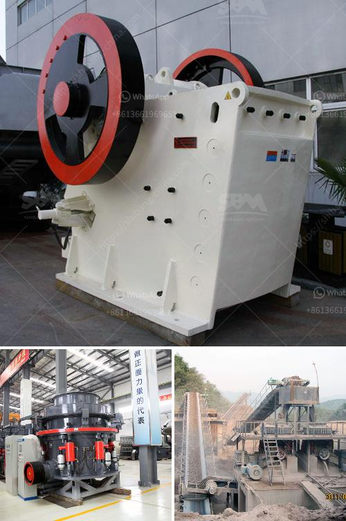

<h3>feldspar vsi crusher</h3>
Feldspar is the most abundant mineral on Earth's crust, but it is often overlooked due to its relatively low economic value. Although feldspar has numerous industrial applications, including glass and ceramic manufacturing, it is in the construction industry where its potential truly shines. Extracting feldspar from quarries and processing it into various grades is a significant undertaking. However, with the integration of advanced crushing technology, particularly the feldspar VSI crusher, the process has become much more efficient and cost-effective.

VSI, or Vertical Shaft Impact, crushers are commonly used in the aggregate and mining industries. These crushers hasten the material's breaking process, significantly reducing the required energy and wear on traditional crushing equipment. The feldspar VSI crusher, a true game-changer in the industry, not only improves the production capacity and crushing efficiency but also expands the application range of feldspar.

One of the primary advantages of employing a VSI crusher for feldspar extraction is its high energy efficiency. The VSI crusher operates by hurling the material against a series of anvils, lining its crushing chamber. As the rocks are broken down, the energy generated by the collision between the feldspar particles and the anvils propels the material forward, creating a satisfying particle size distribution.

This high-energy impact also causes the material to be crushed through a series of fractures, increasing both the crushing efficiency and the quality of the final product. The feldspar VSI crusher not only improves the crushing efficiency but also reduces the need for subsequent grinding processes, helping to save considerable energy consumption.

Moreover, the feldspar VSI crusher has an exceptional ability to handle hard and abrasive materials, creating a more versatile process. As different feldspar deposits have varying compositions, it is crucial to have a crusher that can process diverse materials. Effortlessly crushing various feldspar grades, the VSI crusher ensures a consistent product, further enhancing its value in the industry.

Furthermore, the feldspar VSI crusher promotes particle liberation, allowing for better separation of minerals during subsequent processing stages. By reducing the particle size, the VSI crusher optimizes the froth flotation process, typically used to extract valuable minerals from feldspar ores. Improved liberation ultimately translates into improved recovery rates and increased overall profitability.

As the economic and environmental demands of the industry grow, mining companies are increasingly seeking more sustainable practices. The feldspar VSI crusher addresses this concern by reducing the overall environmental footprint associated with quarrying and processing. With its high energy efficiency and reduced need for additional crushing and grinding processes, mining companies can significantly reduce their energy consumption and carbon emissions.

In conclusion, the feldspar VSI crusher is a groundbreaking innovation that revolutionizes the crushing industry. Through its high energy efficiency, versatility, and improved particle liberation, this crusher offers numerous benefits for mining companies and contractors alike. With feldspar being such a prevalent mineral, its application in various industries will only continue to grow. By embracing the feldspar VSI crusher, the mining industry can unlock the full potential of this abundant material, contributing to a more sustainable and efficient future.
<h3>Contact us</h3><ul><li><strong>Whatsapp:&nbsp;<a href="https://wa.me/8613661969651">+8613661969651</a></strong></li><li><a href="https://swt.shibang-china.com/?git&amp;zhl&amp;feldspar vsi crusher"><strong>Online Service(chat now)</strong></a></li></ul><h3>Related</h3><ul><li><a href='tph jaw crusher price.md'>tph jaw crusher price</a></li><li><a href='brick factory for sale in uk.md'>brick factory for sale in uk</a></li><li><a href='slag crushing plant.md'>slag crushing plant</a></li><li><a href='carbonate from barite manufacturing process.md'>carbonate from barite manufacturing process</a></li><li><a href='vertical horizontal milling machine.md'>vertical horizontal milling machine</a></li></ul>