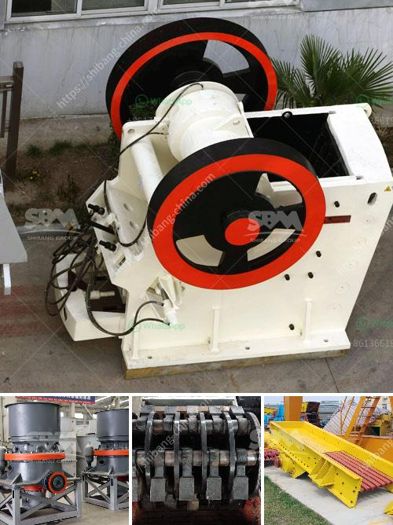

<h3>floatation method of analysis for silica sand</h3>
Silica sand is a major component of many construction materials, such as concrete, asphalt, and mortar. It is also used in the manufacture of glass, ceramics, and refractory materials. Therefore, accurate analysis of silica sand is crucial in ensuring its quality and suitability for different applications. The floatation method is one of the most widely used techniques for the analysis of silica sand.

The floatation method is based on the principle that silica sand is hydrophobic, meaning it repels water. This property allows silica sand particles to be separated from other impurities by selectively attaching to air bubbles in a flotation cell. The floatation process involves several steps, including grinding the silica sand to a fine powder, mixing it with water, adding a flotation reagent, and aerating the mixture.

In the first step, the silica sand is ground to a desired particle size, typically between 100 and 400 mesh. Grinding ensures uniformity and increases the surface area of the particles, improving the efficiency of the flotation process. The ground silica sand is then mixed with water in a flotation cell.

Next, a flotation reagent is added to the mixture. The most commonly used reagent for silica sand flotation is an amine-based collector. The collector molecules attach to the surface of the silica sand particles, making them hydrophobic and enabling them to be captured by air bubbles.

Once the reagent is added, the mixture is aerated by introducing air into the flotation cell. The air bubbles attach to the hydrophobic silica sand particles, causing them to rise to the surface of the cell. As the particles collect at the surface, they form a froth layer, which is skimmed off to separate the silica sand from the remaining water and impurities.

The separated silica sand can then be dried and analyzed to determine its composition and quality. Various analytical techniques can be employed, such as X-ray fluorescence (XRF) spectroscopy, X-ray diffraction (XRD), and particle size analysis. These techniques provide valuable information about the silica content, impurity levels, and particle size distribution of the sand.

The floatation method of analysis offers several advantages for the analysis of silica sand. Firstly, it is a well-established and widely used technique, making it readily available and accessible to laboratories. It also allows for the rapid analysis of large quantities of silica sand, making it suitable for quality control and production monitoring purposes.

Furthermore, the floatation method is selective and efficient in separating silica sand from other impurities. This ensures accurate analysis results and reliable quality assessment of the sand. Additionally, the method is relatively simple and cost-effective compared to other analytical techniques, making it a preferred choice for many industries.

In conclusion, the floatation method of analysis for silica sand is a reliable and efficient technique that enables the separation and analysis of silica sand particles from other impurities. By utilizing the hydrophobic properties of silica sand, the method offers accurate and timely analysis results, ensuring the quality and suitability of silica sand for various applications.
<h3>Contact us</h3><ul><li><strong>Whatsapp:&nbsp;<a href="https://wa.me/8613661969651">+8613661969651</a></strong></li><li><a href="https://swt.shibang-china.com/?git&amp;zhl&amp;floatation method of analysis for silica sand"><strong>Online Service(chat now)</strong></a></li></ul><h3>Related</h3><ul><li><a href='small gold processing plants for tanzania.md'>small gold processing plants for tanzania</a></li><li><a href='overland conveyor cost calculator.md'>overland conveyor cost calculator</a></li><li><a href='vibrating screen specification pdf.md'>vibrating screen specification pdf</a></li><li><a href='complete gravel production line.md'>complete gravel production line</a></li><li><a href='stone crushers hire scotland.md'>stone crushers hire scotland</a></li></ul>