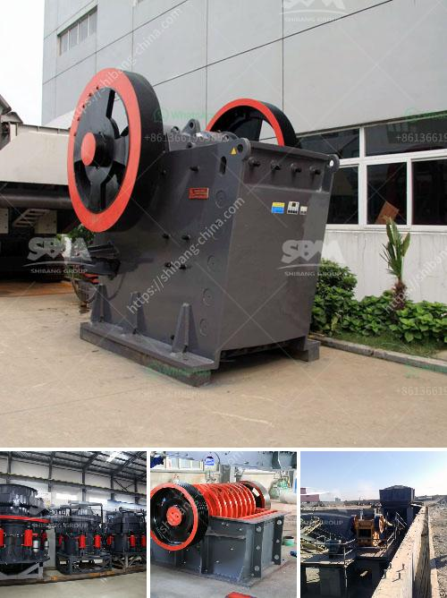

<h3>flsmidth cement plant in egypt</h3>
In the heart of Egypt, FLSmidth's cement plant stands tall as a testament to the country's thriving construction industry. Located in the city of Qena, the plant has become a beacon of innovation and sustainability, providing the necessary infrastructure to meet the growing demand for cement in the region.

One of the key factors that sets FLSmidth's cement plant apart is its state-of-the-art technology. The plant boasts the latest equipment and machinery, ensuring optimum performance and production efficiency. With a production capacity of X million tons per year, it plays a vital role in Egypt's cement industry, contributing to the country's economic growth and development.

In addition to its advanced technology, FLSmidth's cement plant is committed to sustainability. The plant implements various environmental initiatives to minimize its impact on the surrounding ecosystem. From reducing carbon emissions to promoting water conservation, the plant is at the forefront of environmental stewardship.

Furthermore, FLSmidth's cement plant in Egypt prioritizes the well-being and safety of its workforce. Rigorous safety protocols and training programs are in place to ensure a secure working environment. The plant also invests in the professional development and growth of its employees, promoting a culture of continuous learning and innovation.

Notably, FLSmidth's cement plant is not only focused on meeting the demand for cement within Egypt but also plays a significant role in exporting to neighboring countries. By positioning itself as a regional cement hub, it strengthens Egypt's position as a leading player in the construction industry.

Through its commitment to technology, sustainability, and the well-being of its workforce, FLSmidth's cement plant in Egypt stands as a shining example of success and growth. As the country continues to invest in infrastructure development, this state-of-the-art facility will undoubtedly play a crucial role in meeting demands and driving Egypt's progress in the years to come.
<h3>Contact us</h3><ul><li><strong>Whatsapp:&nbsp;<a href="https://wa.me/8613661969651">+8613661969651</a></strong></li><li><a href="https://swt.shibang-china.com/?git&amp;zhl&amp;flsmidth cement plant in egypt"><strong>Online Service(chat now)</strong></a></li></ul><h3>Related</h3><ul><li><a href='dolomite crusher turkey 200 ton price.md'>dolomite crusher turkey 200 ton price</a></li><li><a href='chinese crusher plants.md'>chinese crusher plants</a></li><li><a href='gold wash plant trummel revelstoke.md'>gold wash plant trummel revelstoke</a></li><li><a href='ball mill equipment 150 ton hr.md'>ball mill equipment 150 ton hr</a></li><li><a href='cone crusher suppliers.md'>cone crusher suppliers</a></li></ul>