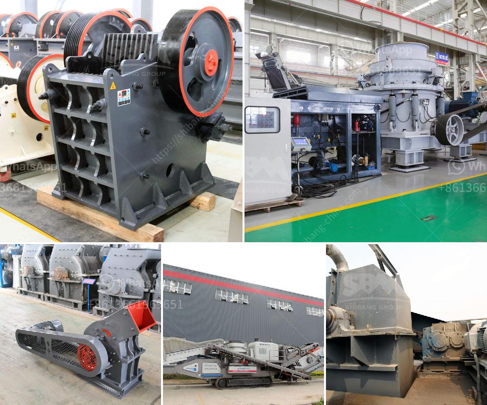

<h3>fly ash processing plant for sale</h3>
Fly ash, also known as pulverized fuel ash, is a byproduct that is generated from the combustion of pulverized coal in power plants. It consists mainly of fine particles of spherical glassy particles, which are collected through pollution control filters.

Over the years, the disposal of fly ash has posed a significant environmental challenge. Landfills are often overloaded with this waste material, and handling it becomes a costly affair. However, with the increasing demand for sustainable practices and the use of fly ash in various industries, the establishment of a fly ash processing plant has become a viable solution.

A fly ash processing plant is a facility where fly ash is transformed into a valuable material that can be used in various applications. The processing plant utilizes various techniques such as crushing, grinding, sorting, and screening to produce a high-quality product. This ensures that the processed fly ash meets the required specifications for use in different industries.

One of the primary applications of processed fly ash is in the construction industry. It can be used as a partial replacement for cement in concrete production. The addition of fly ash enhances the strength, workability, and durability of the concrete. Moreover, it helps reduce the carbon footprint associated with the construction industry by replacing some of the cement content.

The processed fly ash can also be used in the manufacturing of bricks, tiles, and other building materials. Incorporating fly ash into these products not only enhances their structural properties but also reduces the consumption of natural resources. This makes them more sustainable and environmentally friendly.

Furthermore, processed fly ash finds application in the agriculture industry. It can be used as a soil amendment to improve soil health and fertility. The addition of fly ash to the soil helps retain moisture, improve drainage, and enhance nutrient availability. As a result, it promotes healthy plant growth and increases agricultural productivity.

Setting up a fly ash processing plant for sale can be a profitable venture. With the increasing demand for sustainable construction materials and the need to reduce waste disposal, there is a growing market for processed fly ash. By investing in a processing plant, you can tap into this market and offer a valuable product that meets industry standards.

When looking for a fly ash processing plant for sale, it is essential to consider various factors. These include the plant's capacity, processing techniques, automation level, and environmental compliance. Additionally, it is crucial to evaluate the plant's location and infrastructure to ensure smooth operations and efficient transportation of raw materials and finished products.

In conclusion, a fly ash processing plant plays a crucial role in transforming a waste material into a valuable resource. The processed fly ash finds applications in construction, agriculture, and various manufacturing industries. Investing in a fly ash processing plant for sale can be a profitable business opportunity that aligns with the principles of sustainability and environmental responsibility.
<h3>Contact us</h3><ul><li><strong>Whatsapp:&nbsp;<a href="https://wa.me/8613661969651">+8613661969651</a></strong></li><li><a href="https://swt.shibang-china.com/?git&amp;zhl&amp;fly ash processing plant for sale"><strong>Online Service(chat now)</strong></a></li></ul><h3>Related</h3><ul><li><a href='8 kw hammer mill.md'>8 kw hammer mill</a></li><li><a href='how to start a stone crusher business.md'>how to start a stone crusher business</a></li><li><a href='mini cone crusher price used.md'>mini cone crusher price used</a></li><li><a href='gold plant for sale south africa.md'>gold plant for sale south africa</a></li><li><a href='chromite beneficiation plant in malaysia.md'>chromite beneficiation plant in malaysia</a></li></ul>