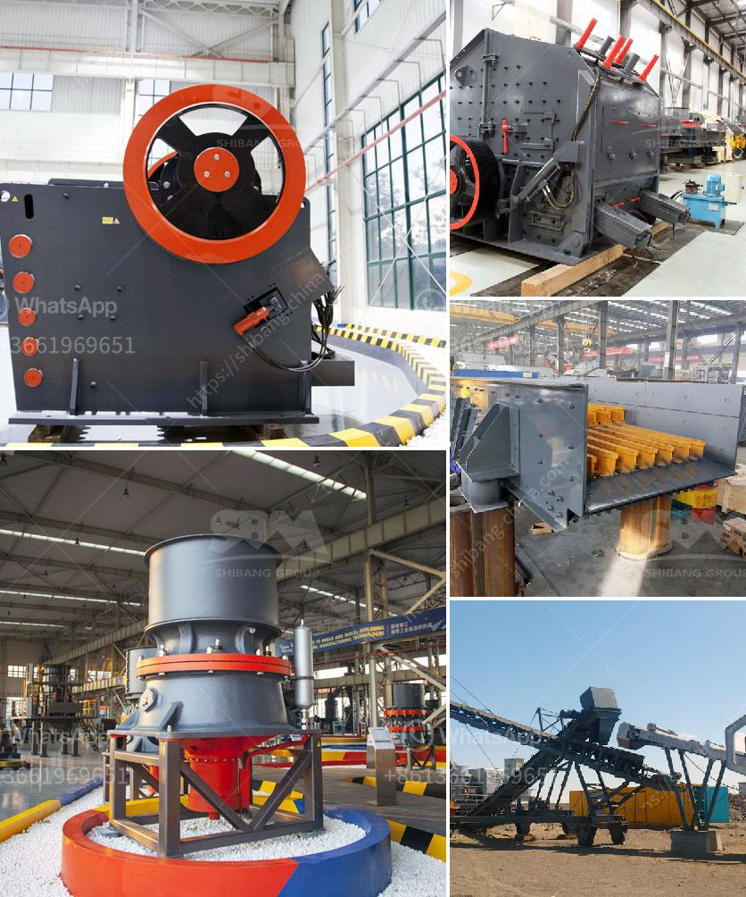

<h3>for crushing plant permit philippines</h3>
Crushing plants are integral to the construction industry as they provide the vital aggregates required for projects. To acquire these materials, the appropriate permits must be secured in order to operate a crushing plant in the Philippines.

One of the most crucial requirements for businesses to obtain a crushing plant permit is approval from the Department of Environment and Natural Resources (DENR). This government agency is tasked with ensuring that businesses comply with environmental regulations by minimizing potential negative impacts on the environment.

Before applying for a crushing plant permit, businesses should conduct an environmental impact assessment (EIA). This assessment evaluates the potential environmental effects of the proposed crushing plant and helps identify measures to mitigate any adverse impacts. The EIA report should include information on wildlife, water quality, air quality, noise levels, and other relevant factors.

In addition to the EIA report, businesses should also submit a comprehensive environmental management plan (EMP). This plan outlines the strategies and measures that the business intends to implement to minimize environmental impacts during the operation and maintenance of the crushing plant. It should include details on dust control measures, noise reduction efforts, and water management practices.

Another important requirement for obtaining a crushing plant permit is a community consultation process. This ensures that the concerns and opinions of the local community are taken into account before the permit is granted. The business should hold public consultations and provide opportunities for community members to express their thoughts and concerns about the proposed crushing plant. Additionally, the business should address any community concerns and incorporate their feedback into the environmental management plan.

Furthermore, businesses seeking a crushing plant permit must comply with the requirements of the Clean Air Act and the Clean Water Act. These acts aim to protect air and water quality by setting standards and regulations for emissions and discharges. The crushing plant should have appropriate pollution control devices and systems in place to comply with these laws. Regular monitoring and reporting of emissions and discharges should also be conducted.

Once the necessary documentation and permits are obtained, the business can begin the construction and operation of the crushing plant. It is important to note that compliance with environmental regulations does not end with the issuance of the permits. Regular monitoring and reporting of environmental performance should be carried out to ensure ongoing compliance.

In conclusion, obtaining a crushing plant permit in the Philippines involves a comprehensive process involving an environmental impact assessment, an environmental management plan, community consultations, and compliance with environmental regulations. By fulfilling these requirements, businesses can operate crushing plants responsibly and contribute to sustainable development in the construction industry.
<h3>Contact us</h3><ul><li><strong>Whatsapp:&nbsp;<a href="https://wa.me/8613661969651">+8613661969651</a></strong></li><li><a href="https://swt.shibang-china.com/?git&amp;zhl&amp;for crushing plant permit philippines"><strong>Online Service(chat now)</strong></a></li></ul><h3>Related</h3><ul><li><a href='roller mill sizes.md'>roller mill sizes</a></li><li><a href='gold ore mining equipment companies in germany.md'>gold ore mining equipment companies in germany</a></li><li><a href='cobalt concentrate processing equiopment manufacturers.md'>cobalt concentrate processing equiopment manufacturers</a></li><li><a href='sell plant of crushing mobile.md'>sell plant of crushing mobile</a></li><li><a href='mineral industrial crushers.md'>mineral industrial crushers</a></li></ul>