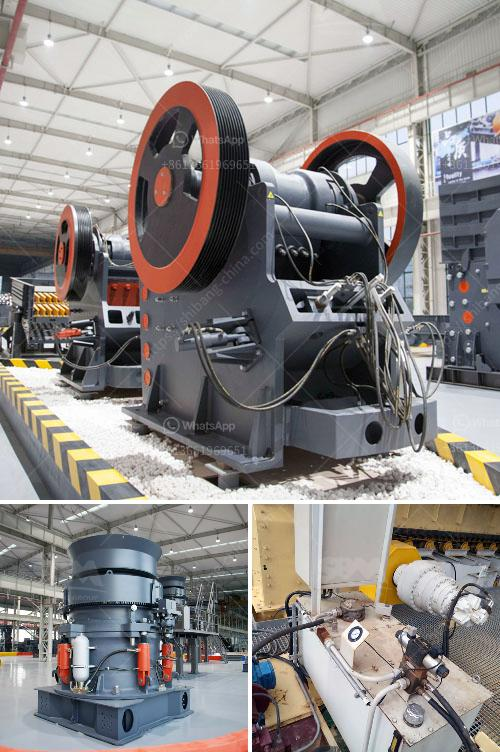

<h3>for sale mobile crusher</h3>
The world of mobile crushers is expanding rapidly, and there is a growing demand for these machines. With their ability to process a wide range of materials, these crushers are a valuable addition to any construction site. One such machine that has caught the eye of many contractors is the mobile crusher.

A mobile crusher, also known as a mobile crushing plant, is a unique machine that allows the users to crush and process rocks on the go. It can be easily transported in any road or working site and is flexible in usage, making it highly convenient for construction companies looking to utilize this machinery.

The primary advantage of a mobile crusher is its portability. With a traditional crusher, the need for transportation becomes a significant concern. However, with a mobile crusher, this issue is eliminated as the machine can be easily transported to any work site. Whether it is a remote location or a cramped city street, the mobile crusher can reach there, allowing the workers to crush the material on site.

Another advantage is its versatility in processing various materials. A mobile crusher can handle different types of rocks, such as granite, limestone, and even concrete. This flexibility makes it a cost-effective solution as there is no need to transport the material to a fixed location for crushing. The material can be crushed right where it is extracted, reducing transportation costs and time.

The ease of maintenance and operation is another significant benefit of a mobile crusher. These machines are designed with user-friendliness in mind. The controls are intuitive and straightforward, allowing operators to quickly learn and operate the crusher without much training. Additionally, the maintenance requirements are minimal, with regular check-ups and servicing ensuring smooth operation for a prolonged period.

One of the popular models of mobile crushers currently available in the market is the XYZ model. It is equipped with advanced features that enhance its productivity. The XYZ model is powered by a powerful engine that ensures efficient crushing of rocks. The machine can crush up to 200 tons of material per hour, making it suitable for large-scale projects.

In terms of safety, mobile crushers are designed with various safety features to protect workers and prevent accidents. The machine is equipped with advanced sensors and alarms that alert the operator in case of any potential hazards. The machine also has safety guards and emergency stop buttons, ensuring the safety of the workers.

In conclusion, a mobile crusher is an excellent investment for construction companies looking to crush and process materials on site. Its portability, versatility, and ease of maintenance make it a valuable addition to any project. With a wide range of models available in the market, there is a mobile crusher suitable for every construction site.
<h3>Contact us</h3><ul><li><strong>Whatsapp:&nbsp;<a href="https://wa.me/8613661969651">+8613661969651</a></strong></li><li><a href="https://swt.shibang-china.com/?git&amp;zhl&amp;for sale mobile crusher"><strong>Online Service(chat now)</strong></a></li></ul><h3>Related</h3><ul><li><a href='stone crushers in veracruz.md'>stone crushers in veracruz</a></li><li><a href='ball mill supplier in pune.md'>ball mill supplier in pune</a></li><li><a href='picture of concrete crusher machine.md'>picture of concrete crusher machine</a></li><li><a href='calcium carbonate mining manufacturer in malaysia.md'>calcium carbonate mining manufacturer in malaysia</a></li><li><a href='cement grinding units manufacturing in bangalore.md'>cement grinding units manufacturing in bangalore</a></li></ul>