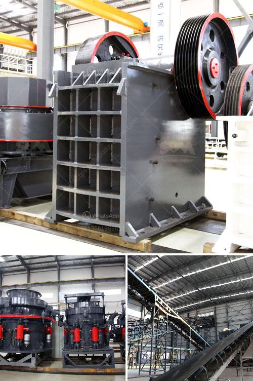

<h3>format of the business plan for stone crusher</h3>
When starting a stone crushing business, it is important to assess the potential profits and expenses involved. To do this, a comprehensive and well-structured business plan is essential. A stone crushing business plan not only helps in identifying the resources needed for the venture but also acts as a roadmap for success.

The format of a business plan for stone crusher consists of an executive summary, an introduction, and appendix sections. This document is a full guide to understanding the business objectives, followed by details on how the venture will be established, and information on the required resources, income projections, and location analysis.

In the executive summary, the main objectives of the stone crushing business are outlined, along with the target market and competition analysis. This section provides a brief overview of the entire business plan.

The introduction gives a detailed description of the business, its background, the target market, and the approach to be followed. It should also mention the legal and regulatory requirements that need to be fulfilled to operate the business legally.

The appendix section includes ancillary information, such as permits, licenses, and legal documents required to run the stone crushing business. It also covers financial projections, such as income statements, cash flow forecasts, and balance sheets.

Furthermore, the format of the business plan for stone crusher should include assessment of the potential risks and challenges associated with the venture. This includes a SWOT (strengths, weaknesses, opportunities, and threats) analysis, which helps identify ways to mitigate risks and exploit opportunities.

In conclusion, creating a business plan for a stone crushing venture is crucial for assessing the feasibility of the enterprise. It provides a roadmap for success and helps in securing funding from investors or financial institutions. By following a well-structured format, entrepreneurs can effectively communicate their vision and plans for the stone crushing business to relevant stakeholders.
<h3>Contact us</h3><ul><li><strong>Whatsapp:&nbsp;<a href="https://wa.me/8613661969651">+8613661969651</a></strong></li><li><a href="https://swt.shibang-china.com/?git&amp;zhl&amp;format of the business plan for stone crusher"><strong>Online Service(chat now)</strong></a></li></ul><h3>Related</h3><ul><li><a href='equipment costs for cement plant.md'>equipment costs for cement plant</a></li><li><a href='stone crusher plant in kenya.md'>stone crusher plant in kenya</a></li><li><a href='crusher plant in malaysia.md'>crusher plant in malaysia</a></li><li><a href='200 tph crusher plant.md'>200 tph crusher plant</a></li><li><a href='how to make a ball crusher.md'>how to make a ball crusher</a></li></ul>