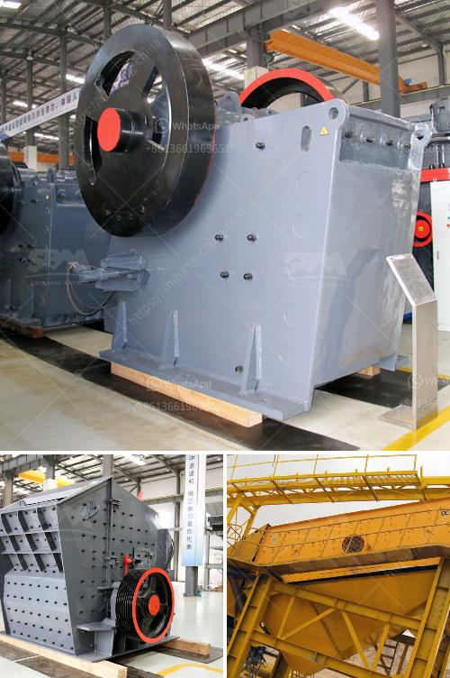

<h3>forno paragon para venda</h3>
Are you a passionate home baker or a professional pastry chef looking for a high-quality oven to elevate your baking skills? Look no further than the Forno Paragon para venda. This exceptional oven is designed to provide chefs with the perfect baking environment, ensuring consistent and delicious results every time.

The Forno Paragon para venda is a versatile and reliable oven that caters to the needs of both residential and commercial kitchens. With its sleek design and advanced features, it has become a sought-after choice among baking enthusiasts worldwide.

One of the standout features of the Forno Paragon para venda is its exceptional temperature control. The oven is meticulously engineered to maintain a precise and even temperature throughout the baking process. This ensures that your cakes, pastries, and breads are baked to perfection, with a golden crust and light, fluffy texture.

Whether you are baking delicate macarons or artisanal sourdough bread, the Forno Paragon para venda offers the flexibility needed to achieve excellent results. It comes with multiple baking modes, giving you the freedom to experiment with various baking techniques. From convection baking to steam-assisted baking, this oven can handle it all.

In addition to its impressive baking capabilities, the Forno Paragon para venda also boasts a user-friendly interface. The oven is equipped with a digital control panel, making it easy to set the desired temperature, time, and baking mode. The intuitive interface ensures that even beginner bakers can operate the oven without any hassle.

Furthermore, the Forno Paragon para venda is built to last. It is constructed with high-quality materials, making it durable and resistant to wear and tear. This means that you can rely on this oven to serve you for many years to come, even with regular use in a busy kitchen.

For those concerned about energy efficiency, the Forno Paragon para venda excels in this area as well. It is designed to minimize energy consumption while maintaining optimal baking performance. This not only helps reduce your environmental impact but also saves you money on utility bills.

When it comes to maintenance, the Forno Paragon para venda makes your life easier. The oven features a self-cleaning function, eliminating the need for tedious scrubbing and cleaning. Simply activate the self-clean mode, and the oven will take care of the rest, leaving you with more time to focus on your culinary creations.

To conclude, the Forno Paragon para venda is the ultimate solution for all your baking needs. Its exceptional temperature control, versatile baking modes, user-friendly interface, durability, energy efficiency, and self-cleaning capabilities make it a top choice for both amateur and professional bakers.

Investing in the Forno Paragon para venda guarantees that your baked goods will be consistently delicious, allowing you to showcase your culinary talent and impress even the most discerning palates. Upgrade your baking game today and experience the joy of creating delectable treats with this exceptional oven.
<h3>Contact us</h3><ul><li><strong>Whatsapp:&nbsp;<a href="https://wa.me/8613661969651">+8613661969651</a></strong></li><li><a href="https://swt.shibang-china.com/?git&amp;zhl&amp;forno paragon para venda"><strong>Online Service(chat now)</strong></a></li></ul><h3>Related</h3><ul><li><a href='equipment costs for cement plant.md'>equipment costs for cement plant</a></li><li><a href='used grinding mills for sale.md'>used grinding mills for sale</a></li><li><a href='jaw crushers price south africa.md'>jaw crushers price south africa</a></li><li><a href='diagram of stone crusher operation.md'>diagram of stone crusher operation</a></li><li><a href='gold mining equipment in uae.md'>gold mining equipment in uae</a></li></ul>