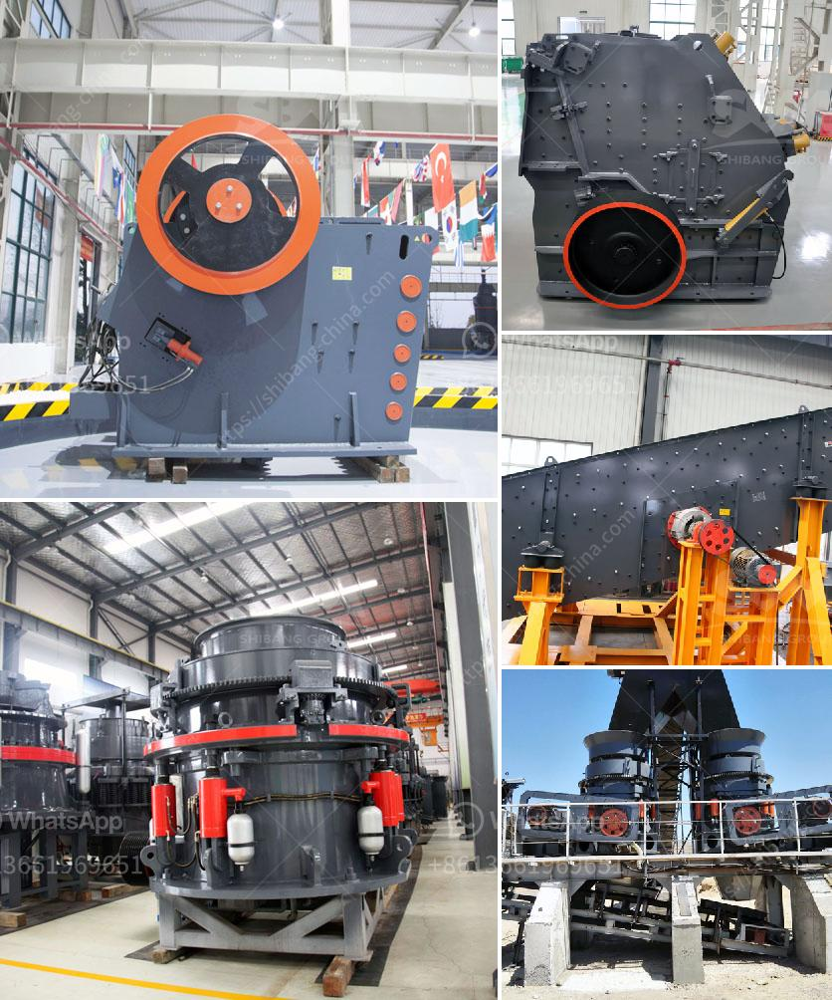

<h3>fullers earth powder grinding machines in india</h3>
Fuller's earth powder is a natural absorbent material that has been used for centuries for various purposes. One of its most popular uses in modern times is as a facial mask or cleanser due to its excellent ability to remove dirt, oil, and impurities from the skin. To meet the growing demand for Fuller's earth powder, numerous grinding machines have been developed over the years in India.

India is known for its vast resources of Fuller's earth, with the country being one of the world's leading producers. This abundance of raw material has also led to the development of a thriving industry that manufactures and exports Fuller's earth powder to different parts of the world.

Grinding machines are essential in this process, as they reduce the size of the Fuller's earth material, making it easier to package and distribute. There are various types of grinding machines available in India, each with its own unique features, benefits, and applications. Let's take a closer look at some of the most common grinding machines used for Fuller's earth powder.

1. Raymond Mill: This is a commonly used grinding machine for producing coarse powder. It features a vertical structure with a small footprint, making it suitable for small-scale production facilities. The Raymond mill is known for its high efficiency and low energy consumption, making it a popular choice for grinding Fuller's earth powder.

2. Ball Mill: A ball mill is a type of grinder used to grind and blend materials for use in mineral dressing processes, paints, pyrotechnics, ceramics, and selective laser sintering. It works on the principle of impact and attrition: size reduction is done by impact as the grinding media cascades down the rotating shell. The ball mill is widely used in the production of Fuller's earth powder, as it can grind materials of various hardness levels.

3. Vertical Roller Mill: This machine is specifically designed to grind Fuller's earth materials such as clay, shale, limestone, and more. It operates on the principle of compressive force, where the grinding roller crushes the material against the surface of a rotating table. The vertical roller mill is known for its high production capacity and energy efficiency.

4. Hammer Mill: A hammer mill is a machine used to shred or crush materials into smaller pieces. It works on the principle of impact, where the hammers driven by the rotor collide with the materials and break them into smaller particles. Hammer mills are commonly used in the grinding process of Fuller's earth powder due to their versatility and ability to produce fine and uniform particles.

In conclusion, the grinding machines used for Fuller's earth powder in India play a vital role in the production and distribution of this popular natural absorbent material. These machines not only reduce the size of the raw material but also ensure that the final product is of high quality and consistency. With the growing demand for Fuller's earth powder worldwide, the grinding machine industry in India is poised for significant growth and development in the coming years.
<h3>Contact us</h3><ul><li><strong>Whatsapp:&nbsp;<a href="https://wa.me/8613661969651">+8613661969651</a></strong></li><li><a href="https://swt.shibang-china.com/?git&amp;zhl&amp;fullers earth powder grinding machines in india"><strong>Online Service(chat now)</strong></a></li></ul><h3>Related</h3><ul><li><a href='stone crusher conveyor belts.md'>stone crusher conveyor belts</a></li><li><a href='used rock crusher dealers in usa.md'>used rock crusher dealers in usa</a></li><li><a href='bentonite clay processing plant.md'>bentonite clay processing plant</a></li><li><a href='tph jaw crusher price.md'>tph jaw crusher price</a></li><li><a href='fuller traylor nt gyratory crusher manual.md'>fuller traylor nt gyratory crusher manual</a></li></ul>