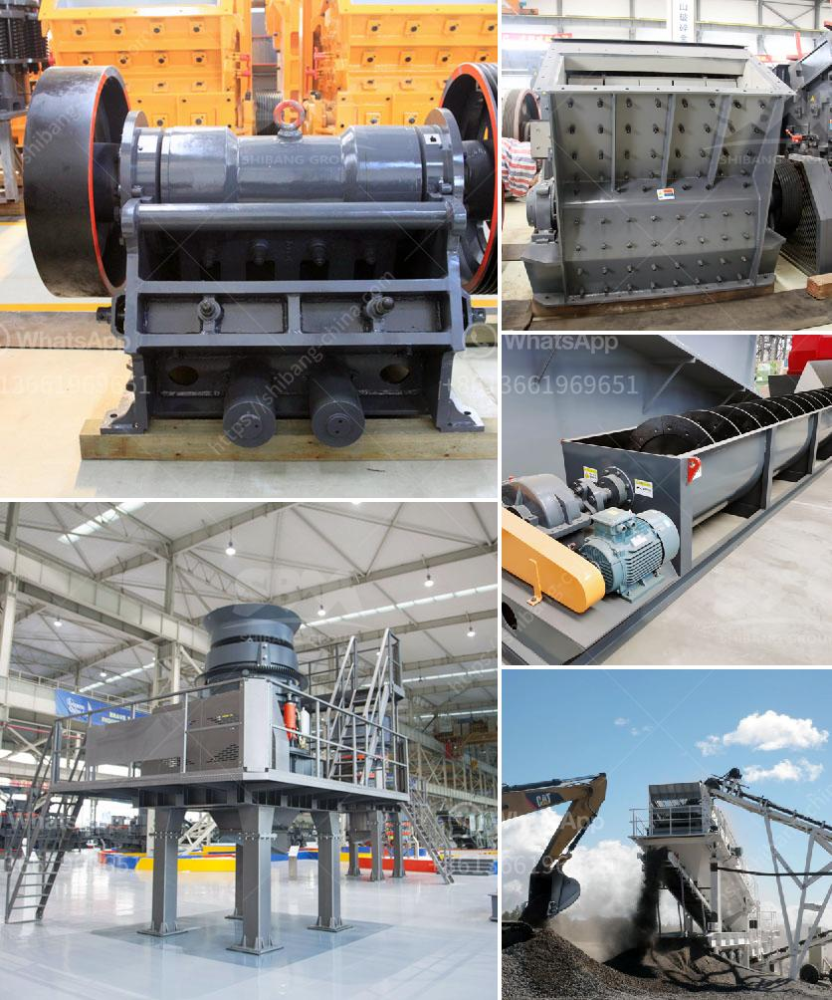

<h3>galena crushing and processing</h3>
Galena, also known as lead sulfide, is a common mineral found in various geological settings. It has been used for centuries as a vital source of lead, a versatile metal in various industrial applications. The process of galena crushing and processing is essential for extracting valuable metals from the ore.

Galena, commonly known as lead ore, is widely used in industries such as construction, batteries, and ammunition. Considering its valuable properties, it is often considered an important industrial material. Traditionally, the extraction of galena involves crushing, screening, and grinding to obtain desired lead concentrate. This process serves as an initial step in extracting lead from the ore.

The crushing and processing of galena are performed to selectively separate lead minerals from gangue minerals. This process, which is progressing from the underground mine to the surface, involves many stages. Initially, the ore is extracted from the underground mine and transported to the surface for further processing.

The first step in the surface processing of galena is the primary crushing. It is usually carried out by a jaw crusher capable of handling large feed sizes. The jaw crusher reduces the ore size to 80% passing the crushed material to a vibrating screen, where sizing is achieved according to the desired particle size distribution.

The galena ore is then further crushed and screened to reduce its size further. After that, it undergoes grinding using a ball mill, where the ore is finely ground to achieve greater liberation of minerals. Subsequently, the finely crushed ore is mixed with water and various chemicals including collector, frother, and modifier. This mixture is then subjected to flotation.

Flotation is the most widely used method for separating valuable minerals from their ores. The process involves selectively attaching hydrophobic particles to air bubbles, which rise to the surface, while the hydrophilic particles settle at the bottom. In the case of galena, the flotation process aims to separate lead minerals from other gangue minerals, such as quartz and calcite.

The flotation process includes conditioning the ore with various chemicals to enhance the selective attachment of hydrophobic particles to air bubbles. Typically, xanthates are used as collectors to promote the attachment of galena particles to the air bubbles. Additionally, frothers are employed to stabilize the air bubbles, aiding in their transportation to the surface.

Once separated from the gangue minerals, the lead concentrate is dewatered and filtered to obtain a dry, concentrated product. These lead concentrates are then transported to smelters for further refining and processing. Smelters transform the concentrate into pure lead or other lead-containing products suitable for industrial use.

In summary, the crushing and processing of galena ore are critical steps in the extraction of lead. The process involves crushing the ore to a certain size, followed by grinding, mixing with chemicals, and flotation to selectively separate lead minerals from gangue minerals. These processes ensure the production of high-grade lead concentrates, which are further processed in smelters. Galena processing plays a crucial role in supporting various industries that rely on lead, making it an essential mineral in the global economy.
<h3>Contact us</h3><ul><li><strong>Whatsapp:&nbsp;<a href="https://wa.me/8613661969651">+8613661969651</a></strong></li><li><a href="https://swt.shibang-china.com/?git&amp;zhl&amp;galena crushing and processing"><strong>Online Service(chat now)</strong></a></li></ul><h3>Related</h3><ul><li><a href='aggregate production line.md'>aggregate production line</a></li><li><a href='component and processes of cement.md'>component and processes of cement</a></li><li><a href='concrete recycling equipment manufacturers.md'>concrete recycling equipment manufacturers</a></li><li><a href='raymond mill india price.md'>raymond mill india price</a></li><li><a href='accessories for chia conveyor belts.md'>accessories for chia conveyor belts</a></li></ul>